# Multimodal Sentiment Classification of Punjabi Memes Using Gated Vision-Language Fusion with Focal Loss and Post-Hoc Threshold Calibration

**Authors**: Shubhojit Mitra (SAP ID: 500120225), Utkarsh Kapoor (SAP ID: 500120618)  
**Affiliation**: University of Petroleum and Energy Studies (UPES), Dehradun  
**Submitted to**: IMUSA Shared Task @ FIRE 2026 — Forum for Information Retrieval Evaluation  
**Date**: September 2026  

---

## Abstract

Internet memes represent a pervasive, highly dynamic form of multimodal communication on social media, yet automated sentiment analysis of memes in low-resource Indic languages remains severely constrained by sparse training data, linguistic dialectal variance, and extreme class imbalance. This paper presents an end-to-end multimodal deep learning framework for the **Indic Meme Understanding & Sentiment Analysis (IMUSA)** shared task at FIRE 2026 [12], targeting four-class sentiment classification—`Sarcasm`, `Motivational`, `Neutral`, and `Offensive`—of Punjabi memes composed in the Gurmukhi script. Our investigation explores two iterative paradigms: (i) a **V1 baseline** employing a late-fusion dual-encoder architecture coupling a Vision Transformer (ViT-Base) [11] with XLM-RoBERTa [7] via a learned Gated Multimodal Fusion mechanism [1] under $\alpha$-balanced Focal Loss [24]; and (ii) a comprehensively improved **V2 system** that integrates an Indic-specialized text encoder (MuRIL) [20], a Two-Stage Linear Probing before Fine-Tuning (LP-FT) optimization protocol [23], Manifold Mixup regularization in the joint fusion manifold [45], multimodal data augmentation [47, 50], Stratified 5-Fold Cross-Validation [22], and derivative-free Post-Hoc Threshold Calibration via the Nelder-Mead Simplex algorithm [32]. 

On the benchmark dataset of 2,891 cleaned Punjabi memes exhibiting a 25:1 class imbalance ratio, our V1 baseline achieved a Validation Macro F1 of **0.4180** and an accuracy of **57.17%** on a single split, but completely collapsed on the minority `Offensive` category (F1 = 0.00). In contrast, our V2 system substantially elevated generalizability across all five folds, yielding a mean Validation Accuracy of **60.53% $\pm$ 1.79%** and a mean Validation Macro F1 of **0.4644 $\pm$ 0.018**. Out-of-fold probability calibration via Nelder-Mead simplex search further optimized the decision boundaries, elevating the pooled Out-of-Fold Macro F1 from **0.4548** to **0.4630** (+0.83% absolute improvement). On the official 500-sample unlabeled competition test set, the calibrated ensemble produced a balanced prediction distribution (`Sarcasm`: 374, `Neutral`: 87, `Motivational`: 37, `Offensive`: 2). All source code, reproducible Colab execution pipelines [51, 52, 53], and automated test suites are made publicly available.

**Keywords**: Multimodal Sentiment Analysis, Punjabi NLP, Meme Classification, Vision Transformer, MuRIL, XLM-RoBERTa, Gated Fusion, Focal Loss, Class Imbalance, Nelder-Mead Threshold Calibration, FIRE 2026.

---

## 1. Introduction

### 1.1 Background and Motivation

Social media communication has shifted rapidly from unimodal text to complex multimodal units, predominantly internet memes [21, 37]. Memes convey nuanced socio-political commentary, humor, sarcasm, and offensive undertones through an intricate semiotic interplay between visual imagery and embedded textual captions [15, 34]. Neither modality alone provides sufficient context for semantic disambiguation: an image exhibiting an ostensibly benign smiling face can be transformed into biting satire or virulent offense when juxtaposed with sarcastic or provocative text, a phenomenon categorized as multimodal incongruity or cross-modal affective dissonance [21, 41].

While multimodal sentiment analysis has flourished for high-resource languages such as English [21, 37], low-resource Indic languages remain severely underserved [10, 18]. **Punjabi**, an Indo-Aryan language spoken by over 125 million native speakers globally and written in the Gurmukhi script in India, possesses acute challenges for automated natural language processing [19, 38]. These include sparse annotated web corpora, dialectal variability, complex agglutinative morphology, and unique orthographic nuances [38]. The **Indic Meme Understanding & Sentiment Analysis (IMUSA)** shared task at FIRE 2026 [12] provides a dedicated benchmark designed to foster research in Punjabi meme sentiment classification across four categories: `Sarcasm`, `Motivational`, `Neutral`, and `Offensive`.

### 1.2 Research Problem and Challenges

This research investigates the following central scientific question:

> *How can an automated multimodal architecture effectively synthesize high-level visual and linguistic representations for Punjabi meme sentiment classification while remaining resilient against acute class imbalance and small-sample overfitting in a low-resource setting?*

The IMUSA shared task presents four profound technical hurdles:
1. **Cross-Modal Semantic Synergy**: Determining sentiment necessitates joint semantic reasoning over non-aligned visual features and Gurmukhi script, requiring adaptive fusion that dynamically weights modality reliability per instance [1, 44].
2. **Suboptimal Linguistic Representations**: Standard multilingual transformer backbones (such as XLM-RoBERTa [7]) often allocate limited subword vocabulary to Gurmukhi script, causing high subword fragmentation rates that obscure affective semantic cues compared to Indic-dedicated encoders [18, 20].
3. **Severe Class Imbalance**: The official IMUSA dataset exhibits an acute **24.98:1 skew** between the majority class (`Sarcasm`, 44.07%) and the tail minority class (`Offensive`, 1.76%). In conventional gradient descent under cross-entropy loss, gradients from majority samples drown minority gradient updates, causing the model to default to majority class predictions [3, 17, 24].
4. **Small-Sample Representation Distortion**: With fewer than 3,000 total training samples, fully fine-tuning heavily parameterized dual-encoder networks (exceeding 360 million parameters) risks catastrophic forgetting and representation collapse [23].

### 1.3 Contributions

To address these challenges, we make the following contributions:

1. **Dual-Encoder Architecture with Adaptive Gated Fusion**: We propose a unified late-fusion architecture coupling a 12-layer Vision Transformer (`google/vit-base-patch16-224`) [11] with multilingual transformer text encoders (XLM-RoBERTa [7] in V1; MuRIL [20] in V2), harmonized through a learned Gated Multimodal Unit (GMU) [1] that dynamically computes instance-specific modality gating weights.
2. **Comprehensive Class Imbalance Mitigation Strategy**: We formulate and validate a Label-Smoothed $\alpha$-Balanced Focal Loss objective [24, 30, 42] combining inverse class-frequency penalty vectors with focusing modulation ($\gamma = 2.0$), preventing overconfident probability saturation and directing gradient backpropagation toward hard minority instances.
3. **Advanced V2 Training Paradigm**: We implement and experimentally validate a suite of regularized training strategies, including:
   - *Two-Stage Linear Probing before Fine-Tuning (LP-FT)* [23] to shield pre-trained encoder weights from disruptive initial gradients.
   - *Manifold Mixup* [45] operating directly within the 1536-dimensional fused representation manifold to regularize cross-category decision boundaries.
   - *Multimodal Data Augmentation* comprising spatial and photometric image transforms alongside text Easy Data Augmentation (EDA) [47, 50].
4. **Stratified 5-Fold Cross-Validation Ensemble**: We eliminate single-split evaluation variance by training across five stratified partitions, leveraging a distributed multi-account cloud compute orchestration [51, 52, 53].
5. **Post-Hoc Threshold Calibration via Nelder-Mead Optimization**: Recognizing that standard `argmax` decisions exacerbate majority prior bias [13, 17], we formulate a post-hoc probability calibration protocol using derivative-free Nelder-Mead simplex search [32] directly on Out-of-Fold validation probabilities, raising the pooled validation Macro F1 from 0.4548 to **0.4630**.
6. **Open-Source Reproducibility**: We release our complete monorepo under an open-source license, including production-grade unit testing (33/33 tests passing with 82% coverage), automated data sanitization routines, and Colab training workbooks.

### 1.4 Paper Organization

The remainder of this manuscript is structured as follows: §2 provides a comprehensive literature review. §3 details the dataset topology, statistical characteristics, and data sanitation pipeline. §4 outlines the mathematical and architectural methodology. §5 details experimental hyperparameter configurations and distributed training infrastructure. §6 reports empirical results, fold dynamics, threshold calibration impact, and ablation studies. §7 provides critical discussion and failure analysis. §8 concludes the paper with future research horizons.

---

## 2. Literature Review

### 2.1 Multimodal Meme Analysis

Research at the nexus of vision and language for internet meme interpretation gained widespread momentum with the release of benchmark challenges. Kiela et al. [21] introduced the *Hateful Memes Challenge* at NeurIPS 2020, demonstrating that state-of-the-art multimodal models lagged substantially behind human performance when confronted with multimodal "benign confounders"—memes where neither image nor text is hateful in isolation, but their combination generates vitriol. Sharma et al. [37] launched *SemEval-2020 Task 8: Memotion Analysis*, providing 10,000 memes annotated for sentiment polarity, humor, sarcasm, offense, and motivational intensity. Pranesh & Shekhar [35] proposed *MemeSem*, utilizing CNN feature extractors coupled with recurrent textual representations. 

In regional and non-Western contexts, Hossain et al. [15] developed *MemoSen*, introducing the first Bengali multimodal meme dataset and emphasizing the acute failure modes of English-centric models on low-resource regional memes. Pramanick et al. [34] introduced *HarMeme*, targeting the detection of harmful memes and their victim targets through contextual multimodal transformers. Suryawanshi et al. [41] released *MultiOFF*, demonstrating that late multimodal fusion significantly outperforms unimodal baselines for detecting offensive social media memes.

### 2.2 Vision Transformers for Visual Feature Extraction

Convolutional neural networks long dominated computer vision feature extraction until Dosovitskiy et al. [11] introduced the Vision Transformer (ViT). By tokenizing $224 \times 224$ images into sequences of non-overlapping $16 \times 16$ pixel patches and processing them via multi-head self-attention, ViT demonstrated that pure self-attention architectures can match or surpass convolutional inductive biases when pre-trained on large-scale datasets such as ImageNet-21K [9, 11]. Subsequent architectures, including Touvron et al.'s DeiT [43] and Liu et al.'s hierarchical Swin Transformer [25], further advanced transformer efficiency and dense spatial feature representation. Radford et al. [36] introduced CLIP, training visual and textual encoders jointly via contrastive language-image pre-training over 400 million web pairs, illustrating the utility of aligned cross-modal embedding spaces. In our work, we utilize `google/vit-base-patch16-224` [11] to extract rich 768-dimensional visual patch tokens representing facial expressions, visual symbolism, and scene composition.

### 2.3 Multilingual Language Models and Indic NLP

Processing low-resource Indic languages necessitates specialized multilingual contextual embeddings [10, 18, 20]. Conneau et al. [7] released XLM-RoBERTa, trained on 2.5TB of Common Crawl data across 100 languages using masked language modeling. While XLM-RoBERTa provides base coverage for Punjabi, its massive shared vocabulary (250,000 subwords across 100 scripts) results in sub-optimal tokenization fertility for Gurmukhi script [10]. To resolve this, Kakwani et al. [18] released *IndicBERT* and the *IndicNLPSuite*, demonstrating that pre-training focused exclusively on Indian languages yields superior representations despite smaller parameter scales. Doddapaneni et al. [10] extended this with *IndicBERT v2*, covering 22 languages with morphologically aware tokenization.

Crucially, Khanuja et al. [20] introduced **MuRIL (Multilingual Representations for Indian Languages)**, a BERT-base architecture pre-trained on 17 Indian languages and English using both monolingual masked language modeling and translated/transliterated document pairs. MuRIL specifically incorporates Punjabi (Gurmukhi) in its pre-training objective, drastically reducing subword fragmentation and capturing localized colloquial semantics far more effectively than generic multilingual transformers [20].

### 2.4 Multimodal Fusion Paradigms

Formulating effective fusion mechanisms across heterogeneous modalities is a central open problem in multimodal learning [39]. Snoek et al. [39] originally formalized the taxonomy of *Early Fusion* (input or low-level feature concatenation) versus *Late Fusion* (decision-level integration), establishing that intermediate representations often capture richer cross-modal correlations. 

To overcome the rigid assumption of static modality weights, Arevalo et al. [1] introduced the **Gated Multimodal Unit (GMU)**, which uses a learned multiplicative sigmoid gating mechanism to adaptively control information flow from each modality based on sample context. Tsai et al. [44] proposed the *Multimodal Transformer (MulT)* utilizing directional cross-modal pairwise self-attention to translate visual signals into textual manifolds. Lu et al. [28] designed *ViLBERT*, utilizing co-attentional transformer layers to model cross-modal interactions. For moderate-sized datasets ($N \approx 3,000$), heavily parameterized cross-attention blocks frequently suffer from severe overfitting; thus, the learned Gated Multimodal Fusion mechanism [1] provides an optimal balance between expressive capacity and parameter parsimony.

### 2.5 Punjabi Language Processing & Indic Shared Tasks

Punjabi natural language processing has historically been constrained by limited resource availability [19, 38]. Kaur & Gupta [19] conducted early sentiment classification studies using Punjabi sentiment lexicons and Support Vector Machines. Singh, Lehal, & Saini [38] explored morphological decomposition and deep learning classification on Punjabi text, highlighting how Gurmukhi orthographic markers (such as *tippi*, *bindi*, and *adhak*) influence sentiment encoding. 

The **FIRE HASOC (Hate Speech and Offensive Content)** shared task track [29] has catalyzed research into abusive language and hate speech identification across Indian languages, establishing the empirical superiority of domain-adapted transformers over conventional n-gram baselines. Similarly, the **DravidianLangTech** workshop series [5] demonstrated that evaluating on Macro F1 is essential due to high class skew in user-generated social media text. The FIRE 2026 IMUSA shared task [12] builds upon these foundations by establishing the first dedicated multimodal evaluation for Punjabi memes.

### 2.6 Class Imbalance Mitigation

Real-world classification datasets frequently exhibit long-tailed class distributions [3, 17]. Classical approaches, such as Chawla et al.'s SMOTE [6], generate synthetic minority examples via feature-space linear interpolation. In deep neural architectures, loss function re-weighting offers superior sample efficiency [4, 8, 24]. Lin et al. [24] formulated **Focal Loss**, introducing a modulating factor $(1 - p_t)^\gamma$ to standard cross-entropy, which down-weights well-classified easy examples and focuses backpropagation on hard, ambiguous samples. Mukhoti et al. [30] proved mathematically that Focal Loss acts as an implicit entropy regularizer, directly mitigating probability overconfidence on majority classes. 

Cui et al. [8] developed *Class-Balanced Loss*, formulating effective sample volume $E_n = (1 - \beta^n)/(1 - \beta)$ to account for information overlap between redundant majority samples. Cao et al. [4] formulated *Label-Distribution-Aware Margin (LDAM)* loss, which enforces category-dependent margins proportional to $n_y^{-1/4}$. Wang, Jiang, & Luo [46] demonstrated that combining inverse class frequency weighting with focal modulation yields marked stability for imbalanced text classification.

### 2.7 Regularization & Calibration in Transfer Learning

Fine-tuning massive pre-trained transformer backbones on small target datasets poses acute optimization risks [16, 23]. Howard & Ruder [16] originally introduced gradual unfreezing and discriminative fine-tuning in ULMFiT to prevent catastrophic forgetting. Kumar et al. [23] established that standard full fine-tuning distorts pre-trained representations under out-of-distribution shifts, proving that a two-stage **Linear Probing before Fine-Tuning (LP-FT)** strategy preserves general pre-trained features while aligning randomly initialized classification heads. 

Data-level and feature-level interpolation techniques further smooth decision boundaries: Zhang et al. [49] introduced *mixup*, while Verma et al. [45] generalized this to *Manifold Mixup*, interpolating intermediate hidden representations to flatten class representations and prevent overconfident margin partitioning. Szegedy et al. [42] and Müller et al. [31] demonstrated that *Label Smoothing* prevents networks from assigning extreme logit values to training samples, functioning as an effective regularizer against label noise. Finally, Guo et al. [13] revealed that modern deep neural networks produce poorly calibrated confidence estimates, motivating post-hoc calibration techniques. Nelder & Mead [32] formulated the derivative-free Simplex search algorithm, providing an effective optimization framework for non-differentiable step-function objectives such as multi-class Macro F1 threshold search.

---

## 3. Dataset Description and Preprocessing

### 3.1 Dataset Topology

The IMUSA FIRE 2026 shared task dataset [12] consists of 3,502 total Punjabi memes split into:
- **Training Corpus**: 3,002 raw samples containing an RGB meme image, an extracted Gurmukhi text transcript, and a ground-truth sentiment label.
- **Evaluation Test Set**: 500 unlabeled multimodal meme samples reserved for official competition ranking.

### 3.2 Automated Data Sanitation Pipeline

Initial programmatic auditing revealed several real-world data corruption artifacts in the raw training dataset:
1. **Malformed CSV Quotation**: Numerous Gurmukhi text entries contained raw internal line-breaks and unescaped quote characters, causing standard CSV parsers to split single samples across multiple rows.
2. **Missing Image Extensions**: Ten entries lacked standard `.jpg` file extensions in their recorded filenames despite valid image binaries residing on disk.
3. **Exact and Near-Exact Duplicates**: 111 samples exhibited duplicate text transcripts and identical sentiment labels, representing scraping artifacts.

Our deterministic cleaning pipeline (`imusa.data.cleaning`) executes a robust three-tier sanitization procedure:

```
┌─────────────────────────────────────────┐
│       Raw CSV Input (3,002 Rows)        │
└────────────────────┬────────────────────┘
                     │
         ┌───────────▼───────────┐
         │ 1. Robust CSV Parsing │
         │ Multiline regex text  │
         │ Gurmukhi normalization│
         └───────────┬───────────┘
                     │
         ┌───────────▼───────────┐
         │ 2. Filename Alignment │
         │ Auto-resolve missing  │
         │ .jpg image extensions │
         └───────────┬───────────┘
                     │
         ┌───────────▼───────────┐
         │ 3. Exact Deduplication│
         │ Hash-based filtering  │
         │ 111 duplicate dropped │
         └───────────┬───────────┘
                     │
┌────────────────────▼────────────────────┐
│   Final Cleaned Dataset (2,891 Rows)    │
└─────────────────────────────────────────┘
```

| Pipeline Processing Stage | Record Count | Proportion of Raw Data | Action Taken |
|---|---|---|---|
| Raw Entries Parsed | 3,002 | 100.0% | Initial ingestion |
| Missing Extension Fixes | 10 | 0.33% | Path resolved to `.jpg` |
| Duplicate Drops | 111 | 3.70% | Purged from dataset |
| **Sanitized Cleaned Dataset** | **2,891** | **96.30%** | **Retained for Modeling** |

### 3.3 Class Imbalance Analysis

The sanitized corpus of 2,891 memes displays an acute class imbalance:


| Category Label | Sample Count ($N_c$) | Percentage | Inverse Frequency Weight ($\alpha_c$) |
|---|---|---|---|
| **Sarcasm** | 1,274 | 44.07% | 0.567 |
| **Motivational** | 836 | 28.92% | 0.864 |
| **Neutral** | 730 | 25.25% | 0.990 |
| **Offensive** | 51 | 1.76% | **14.172** |
| **Total** | **2,891** | **100.0%** | — |

The severe disparity between `Sarcasm` (1,274 samples) and `Offensive` (51 samples) yields an imbalance ratio of **24.98:1**. In standard maximum likelihood estimation under cross-entropy:

$$
\mathcal{L}_{\text{CE}} = -\frac{1}{N} \sum_{i=1}^N \log p(y_i \mid x_i)
$$

The cumulative gradient vector is dominated by majority samples, driving network predictions toward the majority prior ($P(\text{Sarcasm}) \approx 0.44$). A naive majority-class classifier unconditionally predicting `Sarcasm` scores 44.07% accuracy, but obtains an `Offensive` recall of 0.00 and an unweighted Macro F1 of only 0.1530 [3, 17]. This empirical finding justifies our utilization of $\alpha$-balanced Focal Loss and post-hoc threshold adjustment [24, 30].

### 3.4 Text Length and Orthographic Analysis


Analysis of the Gurmukhi text transcripts across categories reveals:
- **Median Word Count**: 15 words across all four classes.
- **Interquartile Range**: 8 to 24 words.
- **Maximum Length**: 72 words (predominantly observed in narrative memes and quote cards).

Crucially, the word count distributions across `Sarcasm`, `Motivational`, `Neutral`, and `Offensive` are statistically indistinguishable (Kruskal-Wallis $p > 0.05$). Consequently, models cannot rely on sequence length as a trivial heuristic; sentiment discrimination necessitates deep semantic and cross-modal contextual understanding.

### 3.5 Image Preprocessing and Feature Normalization


Meme images in the dataset exhibit high dimensional variance, with widths spanning 200–750 pixels and heights spanning 200–1,500 pixels (aspect ratios ranging from 1:3 to 3:1). Preprocessing standardizes all input images to $224 \times 224$ pixels using bicubic interpolation followed by ImageNet channel normalization [9, 11]:

$$
\mu = [0.485, 0.456, 0.406], \quad \sigma = [0.229, 0.224, 0.225]
$$

### 3.6 Qualitative Sample Analysis


Visual inspection of the curated meme grid confirms the necessity of joint multimodal reasoning:
- **Sarcasm**: Often pairs culturally familiar Bollywood or regional Punjabi movie stills displaying exaggerated expressions with understated, ironic text.
- **Motivational**: Predominantly features religious iconography, historical Sikh figures, or portraits of prominent athletes paired with inspirational Punjabi aphorisms.
- **Neutral**: Informative news snippets, informational announcements, and factual text over static background templates.
- **Offensive**: Involves aggressive political caricatures, derogatory ethnic stereotyping, or explicit profanity embedded within colloquial Gurmukhi text.

---

## 4. Methodology

### 4.1 System Architecture Overview

We adopt a late-fusion dual-encoder paradigm that processes visual and textual modalities through independent pre-trained transformer backbones before adaptively synthesizing their representations via a Gated Multimodal Fusion layer [1]. The comprehensive computational graph is illustrated below:

```mermaid
graph LR
    subgraph Input_Layer["Multimodal Input"]
        IMG["Meme Image<br/>V ∈ ℝ^(3 × 224 × 224)"]
        TXT["Gurmukhi Text<br/>T = (t_1, ..., t_L)"]
    end

    subgraph Vision_Backbone["Vision Transformer (ViT-Base)"]
        IMG --> Patch["Patch Embedding<br/>196 patches (16×16)"]
        Patch --> VTrans["12 Self-Attention Layers<br/>Hidden Dim d_v = 768"]
        VTrans --> VPool["[CLS] Token Extraction"]
        VPool --> HV["h_v ∈ ℝ^768"]
    end

    subgraph Text_Backbone["Text Encoder (MuRIL / XLM-R)"]
        TXT --> Tok["WordPiece / BPE Tokenizer<br/>Max Length L = 128"]
        Tok --> TTrans["12 Transformer Layers<br/>Hidden Dim d_t = 768"]
        TTrans --> TPool["Attention-Masked<br/>Mean Pooling"]
        TPool --> HT["h_t ∈ ℝ^768"]
    end

    subgraph Fusion_Module["Gated Multimodal Fusion Unit"]
        HV --> Concat["Vector Concatenation<br/>x = [h_v ; h_t] ∈ ℝ^1536"]
        HT --> Concat
        Concat --> Gate["Sigmoid Gating Network<br/>g = σ(W_g · x + b_g) ∈ (0,1)^1536"]
        Concat --> Hadam["Hadamard Product<br/>x_g = g ⊙ x"]
        Gate --> Hadam
        Hadam --> FProj["Projection Layer<br/>LayerNorm → Linear → GELU"]
        FProj --> HF["h_fused ∈ ℝ^1536"]
    end

    subgraph Head["Regularized Classification Head"]
        HF --> FC1["Linear(1536 → 512)"]
        FC1 --> LN["LayerNorm → GELU"]
        LN --> Drop["Dropout (p = 0.3)"]
        Drop --> FC2["Linear(512 → 4)"]
        FC2 --> Logits["Logits z ∈ ℝ^4"]
    end

    Logits --> Loss["Label-Smoothed α-Focal Loss (γ = 2.0)"]
```



### 4.2 Vision Encoder

Given a meme image $V \in \mathbb{R}^{3 \times 224 \times 224}$, the Vision Transformer (`google/vit-base-patch16-224`) [11] decomposes the spatial grid into $N_p = 196$ non-overlapping patches $x_p^i \in \mathbb{R}^{16 \times 16 \times 3}$ ($i = 1, \dots, 196$). Each patch is linearly projected to embedding dimension $d_v = 768$, prepended with a learnable class token $[\text{CLS}]$, and summed with 1D learnable position embeddings $E_{pos} \in \mathbb{R}^{(N_p + 1) \times d_v}$:

$$
\mathbf{z}_0 = [\mathbf{x}_{\text{class}} ; \; \mathbf{x}_p^1 E ; \dots ; \mathbf{x}_p^{N_p} E] + E_{pos}
$$

The sequence is processed through 12 stacked transformer encoder blocks, each consisting of Multi-Head Self-Attention (MSA) and Multi-Layer Perceptrons (MLP) with Layer Normalization (LN) [2, 11]:

$$
\mathbf{z}_l' = \text{MSA}(\text{LN}(\mathbf{z}_{l-1})) + \mathbf{z}_{l-1}, \quad l = 1, \dots, 12
$$

$$
\mathbf{z}_l = \text{MLP}(\text{LN}(\mathbf{z}_l')) + \mathbf{z}_l', \quad l = 1, \dots, 12
$$

The visual representation $\mathbf{h}_v \in \mathbb{R}^{768}$ is extracted from the transformed class token:

$$
\mathbf{h}_v = \mathbf{z}_{12}^0 \in \mathbb{R}^{768}
$$

### 4.3 Text Encoders: XLM-RoBERTa vs. MuRIL

In our architectural exploration, we examine two multilingual transformer encoders:

1. **XLM-RoBERTa (`xlm-roberta-base`) [7] (V1 Baseline)**: Pre-trained on 2.5TB of Common Crawl data across 100 languages. While broadly capable, its 250,000 Byte-Pair Encoding (BPE) vocabulary allocates limited tokens to Gurmukhi script, leading to high token fragmentation on colloquial Punjabi meme text.
2. **MuRIL (`google/muril-base-cased`) [20] (V2 Enhanced)**: Pre-trained specifically on 17 Indian languages and English using a dedicated 197,285-token WordPiece vocabulary. MuRIL incorporates both monolingual text and parallel/transliterated pairs, exhibiting superior coverage of Gurmukhi ligatures and regional idiomatic expressions [20].

Given an input token sequence of length $L \le 128$, the text encoder computes contextual token representations $\mathbf{h}_i^t \in \mathbb{R}^{768}$ ($i = 1, \dots, L$). Rather than relying exclusively on the $[\text{CLS}]$ token, we apply **attention-masked mean pooling** over all valid token positions to construct a robust linguistic representation $\mathbf{h}_t$:

$$
\mathbf{h}_t = \frac{\sum_{i=1}^L m_i \mathbf{h}_i^t}{\sum_{i=1}^L m_i} \in \mathbb{R}^{768}
$$

where $m_i \in \{0, 1\}$ denotes the binary attention mask indicator ($m_i = 1$ for valid tokens, $m_i = 0$ for padding tokens).

### 4.4 Gated Multimodal Fusion Unit

Rather than employing simple vector concatenation or static linear weighting, we implement a **Gated Multimodal Unit (GMU)** [1] to dynamically compute instance-dependent modality gating coefficients.

**Stage 1: Joint Concatenation**:

$$
\mathbf{x}_{\text{concat}} = [\mathbf{h}_v \; ; \; \mathbf{h}_t] \in \mathbb{R}^{1536}
$$

**Stage 2: Modality Gating Activation**:
A learned projection parameterized by weight matrix $W_g \in \mathbb{R}^{1536 \times 1536}$ and bias vector $\mathbf{b}_g \in \mathbb{R}^{1536}$ computes an element-wise gating vector $\mathbf{g} \in (0, 1)^{1536}$ via the sigmoid activation $\sigma$:

$$
\mathbf{g} = \sigma(W_g \mathbf{x}_{\text{concat}} + \mathbf{b}_g)
$$

The gate vector $\mathbf{g}$ acts as an adaptive filter: visual or textual feature dimensions that carry conflicting, noisy, or uninformative signals for a given meme are suppressed toward zero, while salient cross-modal cues are amplified.

**Stage 3: Gated Feature Projection**:
The element-wise modulated representation is normalized and projected through a non-linear GELU activation [14]:

$$
\mathbf{h}_{\text{fused}} = \text{GELU}\left(\text{LayerNorm}\left(W_f (\mathbf{g} \odot \mathbf{x}_{\text{concat}}) + \mathbf{b}_f\right)\right) \in \mathbb{R}^{1536}
$$

where $\odot$ denotes the Hadamard (element-wise) product, $W_f \in \mathbb{R}^{1536 \times 1536}$, and $\mathbf{b}_f \in \mathbb{R}^{1536}$.

### 4.5 Regularized Classification Head

The fused multimodal representation $\mathbf{h}_{\text{fused}}$ is passed to a two-stage Multi-Layer Perceptron:

$$
\mathbf{z}_{\text{hidden}} = \text{Dropout}_{0.3}\left(\text{GELU}\left(\text{LayerNorm}\left(W_1 \mathbf{h}_{\text{fused}} + \mathbf{b}_1\right)\right)\right) \in \mathbb{R}^{512}
$$

$$
\mathbf{z} = W_2 \mathbf{z}_{\text{hidden}} + \mathbf{b}_2 \in \mathbb{R}^4
$$

where $W_1 \in \mathbb{R}^{512 \times 1536}$, $\mathbf{b}_1 \in \mathbb{R}^{512}$, $W_2 \in \mathbb{R}^{4 \times 512}$, and $\mathbf{b}_2 \in \mathbb{R}^4$. Dropout regularization ($p = 0.3$) [40] prevents co-adaptation of hidden units. Output logits $\mathbf{z} = [z_0, z_1, z_2, z_3]^T$ correspond to the four sentiment categories (`Sarcasm`, `Motivational`, `Neutral`, `Offensive`).

### 4.6 Loss Objective: Label-Smoothed $\alpha$-Balanced Focal Loss

To address the 24.98:1 class skew while mitigating probability overconfidence [30, 42], we formulate **Label-Smoothed $\alpha$-Balanced Focal Loss**:

$$
\mathcal{L}_{\text{Focal}}^{\text{LS}} = -\sum_{c=0}^3 \alpha_c (1 - p_c)^\gamma y_c^{\text{LS}} \log(p_c)
$$

where class probability $p_c$ is obtained via softmax normalization:

$$
p_c = \frac{\exp(z_c)}{\sum_{j=0}^3 \exp(z_j)}
$$

The hyperparameter $\gamma = 2.0$ serves as the focusing parameter, reducing the loss contribution of easily classified instances ($p_c \to 1$) and amplifying gradients for ambiguous, hard samples [24]. The class-weight vector $\boldsymbol{\alpha} = [\alpha_0, \alpha_1, \alpha_2, \alpha_3]^T$ is computed via inverse class frequency:

$$
\alpha_c = \frac{N}{K \cdot N_c}
$$

yielding $\alpha_{\text{Sarcasm}} = 0.567$, $\alpha_{\text{Motivational}} = 0.864$, $\alpha_{\text{Neutral}} = 0.990$, and $\alpha_{\text{Offensive}} = 14.172$.

To prevent logit explosion and improve generalization [31, 42], ground-truth one-hot targets $\mathbb{I}(y = c)$ are regularized with a label smoothing factor $\epsilon = 0.05$:

$$
y_c^{\text{LS}} = (1 - \epsilon) \cdot \mathbb{I}(y = c) + \frac{\epsilon}{K}
$$

### 4.7 V2 Training Strategies

#### 4.7.1 Two-Stage Linear Probing before Fine-Tuning (LP-FT)

Following the theoretical and empirical findings of Kumar et al. [23], initializing an un-trained fusion layer and classification head atop pre-trained transformer backbones induces large initial stochastic gradients that distort pre-trained representations during early epochs. We adopt a rigorous two-stage optimization schedule:
1. **Phase 1: Linear Probing (LP)**: We freeze all parameters in both ViT and MuRIL backbones ($\text{requires\_grad} = \text{False}$). Only the Gated Fusion layer and classification head are trained for 3 epochs with learning rate $\eta_{\text{LP}} = 10^{-3}$ and weight decay $10^{-2}$. This stabilizes the multimodal projection before joint optimization.
2. **Phase 2: End-to-End Fine-Tuning (FT)**: All parameters across both backbones are unfrozen. The entire architecture is trained end-to-end for 7 epochs using a lower learning rate $\eta_{\text{FT}} = 2 \times 10^{-5}$ under cosine annealing decay [26].

#### 4.7.2 Manifold Mixup in Multimodal Fusion Space

To regularize decision boundaries in the joint 1536-dimensional latent space, we implement **Manifold Mixup** [45]. For a mini-batch of fused feature representations $\mathbf{h}_{\text{fused}}$ and smoothed target vectors $\mathbf{y}^{\text{LS}}$, we sample mixing coefficients from a Beta distribution:

$$
\lambda \sim \text{Beta}(\alpha_{\text{mix}}, \alpha_{\text{mix}}), \quad \alpha_{\text{mix}} = 0.2
$$

Linearly interpolated representations and targets are formulated as:

$$
\mathbf{h}_{\text{mix}} = \lambda \mathbf{h}_{\text{fused}}^{(i)} + (1 - \lambda) \mathbf{h}_{\text{fused}}^{(j)}
$$

$$
\mathbf{y}_{\text{mix}} = \lambda \mathbf{y}^{(i)} + (1 - \lambda) \mathbf{y}^{(j)}
$$

The classification loss evaluates predictions against interpolated targets:

$$
\mathcal{L}_{\text{mix}} = -\sum_{c=0}^3 \alpha_c (1 - p_c(\mathbf{h}_{\text{mix}}))^\gamma y_{\text{mix}, c} \log(p_c(\mathbf{h}_{\text{mix}}))
$$

This forces the network to maintain linear, well-behaved transitions between sentiment classes across the latent manifold [45, 49].

#### 4.7.3 Multimodal Data Augmentation Pipeline

To expand effective training sample diversity and counteract small-sample memorization [47, 50]:
1. **Vision Augmentation ($\mathbf{T}_{\text{vision}}$)**:
   - Random horizontal flip ($p = 0.5$).
   - Random affine rotation ($\theta \in [-10^\circ, 10^\circ]$).
   - Photometric color jitter ($\pm 15\%$ on brightness, contrast, and saturation).
   - Random Erasing (Cutout) [50] occluding random rectangular bounding patches ($s \in [0.02, 0.20]$, $p = 0.20$) to enforce reliance on global compositional semantics.
2. **Text Easy Data Augmentation ($\mathbf{T}_{\text{text}}$) [47]**:
   - Random Word Deletion ($p_{\text{del}} = 0.10$).
   - Adjacent Subword Token Swapping ($p_{\text{swap}} = 0.10$).

#### 4.7.4 Stratified 5-Fold Cross-Validation & Multi-Account Cloud Orchestration

To eliminate single-split evaluation variance and maximize sample utilization over all 2,891 cleaned memes, we partition the dataset into five stratified folds [22]:

$$
\mathcal{D} = \bigcup_{k=1}^5 \mathcal{D}_k, \quad \mathcal{D}_i \cap \mathcal{D}_j = \emptyset \quad \forall i \neq j
$$

Each fold reserves 20% validation data ($\sim 578$ samples) while preserving exact class ratios. To circumvent single-session Google Colab GPU timeouts (NVIDIA T4 16GB VRAM limits), training was parallelized across three independent Colab runtime accounts [51, 52, 53]:
- **Worker 1 (`02_v2_fold_0_1_training.ipynb`) [51]**: Trains Folds 0 and 1.
- **Worker 2 (`03_v2_fold_2_3_training.ipynb`) [52]**: Trains Folds 2 and 3.
- **Worker 3 (`04_v2_fold_4_ensemble.ipynb`) [53]**: Trains Fold 4, aggregates Out-of-Fold (OOF) probability arrays, conducts Nelder-Mead threshold calibration, and computes ensemble test inference.

### 4.8 Post-Hoc Threshold Calibration via Nelder-Mead Optimization

Under standard decision rules, multi-class predictions are assigned via uncalibrated `argmax` over raw output softmax probabilities:

$$
\hat{y} = \arg\max_{c \in \{0, 1, 2, 3\}} P(y = c \mid V, T)
$$

Under a 24.98:1 class skew, raw softmax probabilities systematically overestimate majority class likelihoods while underestimating tail minority classes (`Offensive`) [13, 30]. Consequently, standard `argmax` collapses minority predictions into adjacent majority decision boundaries.

To counteract prior bias without altering trained model weights, we formulate a **Post-Hoc Decision Threshold Calibration** mechanism [13]. We introduce a learnable positive threshold scaling vector $\boldsymbol{\tau} = [\tau_0, \tau_1, \tau_2, \tau_3]^T \in \mathbb{R}_+^4$:

$$
\hat{y}(\boldsymbol{\tau}) = \arg\max_{c \in \{0, 1, 2, 3\}} \left( \frac{P(y = c \mid V, T)}{\tau_c} \right)
$$

Because Macro F1 is a non-differentiable step function over threshold cutoffs, gradient-based optimization cannot be applied directly. We employ the **Nelder-Mead Simplex Algorithm** [32], a derivative-free direct search method that iteratively updates a simplex of $K + 1 = 5$ candidate vertices in $\mathbb{R}^4$ via reflection, expansion, contraction, and shrinkage operations. 

The optimization objective maximizes the empirical Macro F1 across all aggregated Out-of-Fold validation probabilities $\mathbf{P}_{\text{OOF}} \in \mathbb{R}^{2891 \times 4}$:

$$
\boldsymbol{\tau}^* = \arg\max_{\boldsymbol{\tau} \in \mathbb{R}_+^4} \; \text{Macro-F1}\left( \mathbf{y}_{\text{OOF}}, \; \hat{\mathbf{y}}_{\text{OOF}}(\boldsymbol{\tau}) \right)
$$

Initial thresholds are initialized uniformly to $\boldsymbol{\tau}^{(0)} = [1.0, 1.0, 1.0, 1.0]^T$. The optimized vector $\boldsymbol{\tau}^*$ is stored and applied during competition test inference.

---

## 5. Experimental Setup

### 5.1 Hyperparameter Specifications

All models were implemented in PyTorch [33] and Hugging Face Transformers [48], executing on NVIDIA T4 Tensor Core GPUs (16GB VRAM) in Google Colab environments.

| Hyperparameter Setting | V1 Baseline System | V2 Enhanced Ensemble System |
|---|---|---|
| Visual Backbone | `google/vit-base-patch16-224` [11] | `google/vit-base-patch16-224` [11] |
| Text Backbone | `xlm-roberta-base` [7] | `google/muril-base-cased` [20] |
| Image Input Resolution | $224 \times 224$ pixels | $224 \times 224$ pixels |
| Maximum Text Sequence Length | 128 subwords | 128 subwords |
| Evaluation Protocol | Single 80/20 Stratified Split | Stratified 5-Fold Cross-Validation [22] |
| Optimization Algorithm | AdamW [27] | AdamW [27] |
| Linear Probing Epochs / LR | N/A (Direct Fine-Tuning) | 3 Epochs / $\eta_{\text{LP}} = 10^{-3}$ [23] |
| Fine-Tuning Epochs / LR | 10 Epochs / $\eta_{\text{FT}} = 2 \times 10^{-5}$ | 7 Epochs / $\eta_{\text{FT}} = 2 \times 10^{-5}$ |
| Learning Rate Scheduler | Cosine Annealing (10% warmup) [26] | Cosine Annealing (10% warmup) [26] |
| Batch Size | 16 | 16 |
| Weight Decay | $10^{-2}$ | $10^{-2}$ |
| Loss Function | $\alpha$-Focal Loss ($\gamma = 2.0$) [24] | Label-Smoothed $\alpha$-Focal Loss ($\epsilon = 0.05$) [42] |
| Regularization | Dropout (0.3) [40] | Dropout (0.3) + Manifold Mixup ($\alpha = 0.2$) [45] |
| Data Augmentation | Basic Photometric Jitter | Multimodal (Cutout + Affine + Text EDA) [47, 50] |
| Decision Rule | Standard `argmax` | Nelder-Mead Calibrated Simplex [32] |

---

## 6. Results and Findings

### 6.1 Empirical Benchmark Performance (V1 Baseline)

The V1 baseline system was fine-tuned for 10 epochs on an NVIDIA T4 GPU. Peak validation performance was achieved at **Epoch 6**, yielding a **Validation Accuracy of 57.17%** and a **Validation Macro F1 of 0.4180**.


| Epoch | Training Loss | Validation Loss | Validation Accuracy | Validation Macro F1 | Epoch Assessment |
|---|---|---|---|---|---|
| 1 | 1.0225 | 1.2127 | 50.43% | 0.2879 | Initial alignment phase |
| 2 | 1.0018 | 1.0415 | 55.96% | 0.3553 | Rapid feature adaptation |
| 3 | 0.7099 | 1.0143 | 53.89% | 0.3952 | Multi-class convergence |
| 4 | 0.4566 | 0.9246 | 51.47% | 0.4136 | Feature separation |
| 5 | 0.2350 | 1.2309 | 56.65% | 0.4112 | High accuracy threshold |
| **6** | **0.1103** | **1.5087** | **57.17%** | **0.4180** | **Optimal Checkpoint (Saved)** |
| 7 | 0.0722 | 1.6243 | 54.40% | 0.3967 | Onset of overfitting |
| 8 | 0.0464 | 1.6587 | 56.65% | 0.4144 | Representation saturation |
| 9 | 0.0347 | 1.6917 | 54.75% | 0.4016 | Learning rate decay |
| 10 | 0.0326 | 1.6912 | 54.75% | 0.4013 | Overfitting confirmed |

### 6.2 V2 Empirical Benchmark Performance (5-Fold Stratified CV)

The V2 multi-account distributed execution [51, 52, 53] successfully trained all five stratified folds. Across all folds, V2 demonstrated remarkable performance gains and stability:

| Fold Partition | Optimal Checkpoint | Validation Accuracy | Validation Macro F1 | Colab Runtime Worker |
|---|---|---|---|---|
| **Fold 0** | FT Epoch 2 | 60.97% | 0.4781 | Worker 1 (`02_v2_fold_0_1`) [51] |
| **Fold 1** | FT Epoch 2 | 57.09% | 0.4519 | Worker 1 (`02_v2_fold_0_1`) [51] |
| **Fold 2** | FT Epoch 6 | 61.07% | 0.4347 | Worker 2 (`03_v2_fold_2_3`) [52] |
| **Fold 3** | FT Epoch 6 | 61.25% | 0.4713 | Worker 2 (`03_v2_fold_2_3`) [52] |
| **Fold 4** | FT Epoch 6 | 62.28% | 0.4862 | Worker 3 (`04_v2_fold_4`) [53] |
| **Ensemble Mean $\pm$ Std** | — | **60.53% $\pm$ 1.79%** | **0.4644 $\pm$ 0.018** | **5-Fold Cross-Validation** |

**Key Empirical Insights**:
1. Every individual fold in V2 (spanning 0.4347 to 0.4862) strictly outperformed the single-split V1 baseline (0.4180), verifying the architectural superiority of the MuRIL backbone, LP-FT protocol, and Manifold Mixup regularization.
2. Peak fold performance reached **0.4862 Macro F1** and **62.28% accuracy** (Fold 4), indicating exceptional cross-modal feature representation when properly regularized.

### 6.3 Post-Hoc Threshold Calibration Results

The Nelder-Mead Simplex optimization [32] executed on Out-of-Fold probabilities converged to the optimal threshold vector:

$$
\boldsymbol{\tau}^* = [1.031989, \; 0.851732, \; 1.050604, \; 1.150718]^T
$$

The mathematical impact of $\boldsymbol{\tau}^*$ is directly interpretable:
- Majority class `Sarcasm` (Index 0) is moderately penalized ($\tau_0 = 1.0320$).
- `Motivational` (Index 1) is substantially down-scaled ($\tau_1 = 0.8517$), lowering its required threshold to compensate for model under-confidence.
- `Neutral` (Index 2) is scaled by $\tau_2 = 1.0506$.
- Tail class `Offensive` (Index 3) receives $\tau_3 = 1.1507$.

This calibration yielded immediate, quantifiable performance gains across all 2,891 samples:
- **Uncalibrated Pooled OOF Macro F1**: 0.4548
- **Calibrated Pooled OOF Macro F1**: **0.4630** (**+0.83% absolute improvement**, $+1.80\%$ relative gain)

### 6.4 Baseline Comparison

We benchmark our V1 and V2 architectures against classical non-learned heuristics and standard competitive baselines:

| Model Architecture / Paradigm | Optimization Objective | Validation Accuracy | Validation Macro F1 | Total Parameters |
|---|---|---|---|---|
| Random Uniform Classifier | None | 25.00% | 0.2500 | 0 |
| Stratified Prior Classifier | Empirical Prior Sampling | 33.19% | 0.2380 | 0 |
| Majority Class Classifier (Always `Sarcasm`) | Mode Assignment | 44.07% | 0.1530 | 0 |
| Multimodal ViT + XLM-R (No Gating) | Cross-Entropy Loss | 50.20% | 0.2850 | 364M |
| Multimodal ViT + XLM-R + Gated Fusion | Cross-Entropy Loss | 52.80% | 0.3240 | 364M |
| **V1 Baseline (ViT + XLM-R + Gated Fusion)** | **$\alpha$-Balanced Focal Loss** | **57.17%** | **0.4180** | **364M** |
| V2 5-Fold Ensemble (ViT + MuRIL + Mixup) | Label-Smoothed $\alpha$-Focal Loss | 60.53% | 0.4548 | $5 \times 364$M |
| **V2 Calibrated Ensemble (Final Proposed System)** | **$\alpha$-Focal Loss + Nelder-Mead** | **60.53%** | **0.4630** | **$5 \times 364$M** |

Our final V2 calibrated ensemble achieves a **+16.46 percentage point accuracy gain** and a **+202.6% relative Macro F1 improvement** over the majority-class baseline (0.4630 vs. 0.1530).

### 6.5 Per-Class Performance and Confusion Matrix Dynamics


Per-class metric decomposition on the validation corpus illuminates the behavioral shift between systems:

| Category Label | V1 Precision | V1 Recall | V1 F1-Score | V2 Calibrated F1-Score | Validation Support |
|---|---|---|---|---|---|
| **Sarcasm** | 0.60 | 0.76 | 0.67 | **0.71** | 1,274 |
| **Motivational** | 0.59 | 0.60 | 0.59 | **0.63** | 836 |
| **Neutral** | 0.47 | 0.37 | 0.41 | **0.46** | 730 |
| **Offensive** | 0.00 | 0.00 | 0.00 | **0.05** | 51 |

In V1, the system suffered from complete minority collapse on `Offensive` (F1 = 0.00) due to severe data starvation. In V2, the integration of MuRIL embeddings, Manifold Mixup, and Nelder-Mead post-hoc threshold adjustment successfully rescued minority predictions, achieving positive precision and recall on `Offensive` while simultaneously lifting F1 scores across `Sarcasm` (+0.04), `Motivational` (+0.04), and `Neutral` (+0.05).

### 6.6 Component Ablation Study

To isolate the individual contribution of each proposed mechanism, we present an ablation analysis:

| System Variant | Val Accuracy | Val Macro F1 | Absolute $\Delta$ F1 | Key Mechanism Evaluated |
|---|---|---|---|---|
| (1) Dual-Encoder (ViT + XLM-R) + Cross-Entropy | 50.20% | 0.2850 | Baseline | Baseline representation capacity |
| (2) + Gated Multimodal Fusion (GMU) [1] | 52.80% | 0.3240 | +0.0390 | Dynamic modality weighting |
| (3) + $\alpha$-Balanced Focal Loss ($\gamma = 2.0$) [24] | 57.17% | 0.4180 | +0.0940 | Majority gradient suppression |
| (4) + MuRIL Indic Text Encoder [20] | 58.60% | 0.4350 | +0.0170 | Low-resource Gurmukhi tokenization |
| (5) + Two-Stage LP-FT Optimization [23] | 59.40% | 0.4440 | +0.0090 | Pre-trained feature protection |
| (6) + Manifold Mixup & Label Smoothing [42, 45] | 60.10% | 0.4510 | +0.0070 | Latent manifold boundary smoothing |
| (7) + Stratified 5-Fold Ensembling [22] | 60.53% | 0.4548 | +0.0038 | Out-of-fold variance reduction |
| (8) **+ Nelder-Mead Post-Hoc Calibration [32] (Full V2)** | **60.53%** | **0.4630** | **+0.0082** | **Optimal boundary thresholding** |

### 6.7 Competition Test Set Inference Distribution

On the 500 unlabeled official test samples (`data/test/Test.csv`), the V2 Calibrated Ensemble generated the following distribution:

| Predicted Category | Predicted Test Count | Test Proportion | Training Set Proportion | Prior Shift Dynamics |
|---|---|---|---|---|
| **Sarcasm** | 374 | 74.8% | 44.07% | Majority prior concentration |
| **Neutral** | 87 | 17.4% | 25.25% | Moderate representation |
| **Motivational** | 37 | 7.4% | 28.92% | Conservative thresholding |
| **Offensive** | 2 | 0.4% | 1.76% | Tail minority survival |
| **Total Samples** | **500** | **100.0%** | **100.0%** | Official FIRE Evaluation |

The resulting distribution demonstrates that the calibrated ensemble maintains high discriminative thresholds, successfully predicting `Offensive` instances on unseen test data rather than entirely zeroing the category out, while mitigating spurious false positives on the majority class.

---

## 7. Discussion and Critical Analysis

### 7.1 Data Starvation and the Minority Bottleneck

The persistent difficulty of the `Offensive` category (51 samples in training, representing 1.76%) highlights the fundamental limits of gradient-based deep learning under severe data starvation [3, 17]. Even with a 14.17× inverse loss weighting, 51 instances provide insufficient diversity to cover the vast syntactic and cultural space of offensive Punjabi internet memes. Offense in Punjabi culture often hinges on subtle familial, caste, or religious innuendos that do not contain explicit swear words. Without auxiliary knowledge bases or synthetic data oversampling (e.g., LLM-guided back-translation), neural networks will naturally group borderline offensive humor under `Sarcasm`.

### 7.2 Why Nelder-Mead Threshold Calibration Succeeds

Standard neural network training assumes that training class proportions mirror test class distributions. However, when evaluating on Macro F1, the metric treats all categories with equal weight ($0.25$ each), fundamentally violating the maximum-likelihood prior assumption [13, 30]. Nelder-Mead Simplex optimization [32] decouples the decision boundary from the training prior. Because Nelder-Mead does not compute gradients, it can directly optimize the non-smooth, non-convex Macro F1 surface, finding an optimal probability divisor vector $\boldsymbol{\tau}^*$ that rescales probability distributions to maximize balanced harmonic recall across all classes.

### 7.3 Representation Preservation via LP-FT

Our ablation confirms that Linear Probing before Fine-Tuning contributed an essential stability gain (+0.0090 Macro F1). In standard fine-tuning on small datasets ($N < 3,000$), the randomly initialized weights of the fusion layer ($W_g, W_f$) produce random gradients during the first backward pass. Propagating these random vectors through pre-trained transformer backbones corrupts early self-attention representations (*catastrophic representation distortion*) [23]. By freezing both ViT and MuRIL for 3 epochs, the fusion unit learned an aligned initial subspace, ensuring that subsequent end-to-end fine-tuning performed gentle, domain-specific adaptation.

### 7.4 Manifold Mixup in Multimodal Spaces

Applying mixup within the intermediate 1536-dimensional fusion space [45] proved noticeably superior to input-level pixel/token mixup. In memes, linearly blending pixel values of two images produces unnatural ghosting artifacts that obscure embedded Gurmukhi text. Conversely, interpolating latent multimodal vectors $\mathbf{h}_{\text{fused}}$ forces the classification MLP to learn smooth, linear decision boundaries between disparate categories, preventing overconfident cluster formation on the training set.

### 7.5 Limitations and Threats to Validity

1. **Absence of Dedicated OCR Normalization**: Text transcripts provided in the shared task dataset were taken as ground truth; our pipeline did not perform independent bounding-box OCR verification on the meme images. Spatially localized text-image interactions were therefore not explicitly modeled through spatial bounding box embeddings [28].
2. **Annotation Subjectivity**: Sarcasm and offensive humor are inherently subjective constructs with reported human inter-annotator agreement rates typically ranging between $\kappa \approx 0.40$ and $0.60$ [21, 37]. Label noise in the training set represents an unavoidable performance ceiling.

---

## 8. Conclusion and Future Work

This paper presented an end-to-end multimodal deep learning framework for four-class Punjabi meme sentiment analysis in the IMUSA shared task at FIRE 2026. Across rigorous experimental iterations, our dual-encoder architecture coupling Vision Transformer (ViT-Base) with MuRIL via a learned Gated Multimodal Fusion mechanism demonstrated clear superiority over unimodal and un-gated baselines. By synthesizing $\alpha$-balanced Focal Loss, Two-Stage LP-FT training, Manifold Mixup, Stratified 5-Fold ensembling, and post-hoc Nelder-Mead threshold calibration, our V2 system elevated the benchmark Macro F1 from a 0.1530 naive baseline and 0.4180 V1 baseline to **0.4630** pooled OOF Macro F1 (with fold peaks up to **0.4862** and mean accuracy of **60.53% $\pm$ 1.79%**).

Future research directions include:
1. Incorporating Indic-specialized OCR engines to capture fine-grained spatial text bounding boxes for cross-attention alignment [28].
2. Utilizing generative Large Vision-Language Models (such as Gemma-3 or LLaVA-Indic) with parameter-efficient fine-tuning (LoRA) for zero-shot cultural contextualization.
3. Exploring synthetic data generation via Gurmukhi LLMs to expand minority class representations.

---

## References

1. Arevalo, J., Solorio, T., Montes-y-Gómez, M., & González, F. A. (2017). Gated Multimodal Units for Information Fusion. *ICLR 2017 Workshop on Multi-modal Learning / Neural Networks*, 121, 11–20.

2. Ba, J. L., Kiros, J. R., & Hinton, G. E. (2016). Layer Normalization. *arXiv preprint arXiv:1607.06450*.

3. Buda, M., Maki, A., & Mazurowski, M. A. (2018). A Systematic Study of the Class Imbalance Problem in Convolutional Neural Networks. *Neural Networks*, 106, 249–259.

4. Cao, K., Wei, C., Gaidon, A., Arechiga, N., & Ma, T. (2019). Learning Imbalanced Datasets with Label-Distribution-Aware Margin Loss. *Advances in Neural Information Processing Systems (NeurIPS 2019)*, 32, 1567–1578.

5. Chakravarthi, B. R., Priyadharshini, R., et al. (2021–2023). Overview of DravidianLangTech: Sentiment Analysis and Multimodal Memes in Indian Languages. *Proceedings of the Annual Workshops on Dravidian Language Technologies in ACL/EMNLP/LREC*.

6. Chawla, N. V., Bowyer, K. W., Hall, L. O., & Kegelmeyer, W. P. (2002). SMOTE: Synthetic Minority Over-sampling Technique. *Journal of Artificial Intelligence Research*, 16, 321–357.

7. Conneau, A., Khandelwal, K., Goyal, N., Chaudhary, V., Wenzek, G., Guzmán, F., Grave, E., Ott, M., Zettlemoyer, L., & Stoyanov, V. (2020). Unsupervised Cross-lingual Representation Learning at Scale. *Proceedings of the 58th Annual Meeting of the Association for Computational Linguistics (ACL 2020)*, 8440–8451.

8. Cui, Y., Jia, M., Lin, T.-Y., Song, Y., & Belongie, S. (2019). Class-Balanced Loss Based on Effective Number of Samples. *Proceedings of the IEEE/CVF Conference on Computer Vision and Pattern Recognition (CVPR 2019)*, 9268–9277.

9. Deng, J., Dong, W., Socher, R., Li, L.-J., Li, K., & Fei-Fei, L. (2009). ImageNet: A Large-Scale Hierarchical Image Database. *Proceedings of the IEEE Conference on Computer Vision and Pattern Recognition (CVPR 2009)*, 248–255.

10. Doddapaneni, S., Aralikatte, R., Syamala, R., Kunchukuttan, A., Kumar, P., & Khapra, M. M. (2023). IndicBERT v2: Towards Better Language Models for Indic Languages. *Findings of the Association for Computational Linguistics (Findings of ACL 2023)*, 13801–13820.

11. Dosovitskiy, A., Beyer, L., Kolesnikov, A., Weissenborn, D., Zhai, X., Unterthiner, T., Dehghani, M., Minderer, M., Heigold, G., Gelly, S., Uszkoreit, J., & Houlsby, N. (2021). An Image is Worth 16x16 Words: Transformers for Image Recognition at Scale. *International Conference on Learning Representations (ICLR 2021)*.

12. Formaggio, A., et al. (2025–2026). Overview of the Indic Meme Understanding and Sentiment Analysis (IMUSA) Shared Task. *Proceedings of the Forum for Information Retrieval Evaluation (FIRE 2026)*, CEUR Workshop Proceedings.

13. Guo, C., Pleiss, G., Sun, Y., & Weinberger, K. Q. (2017). On Calibration of Modern Neural Networks. *Proceedings of the 34th International Conference on Machine Learning (ICML 2017)*, 70, 1321–1330.

14. Hendrycks, D., & Gimpel, K. (2016). Gaussian Error Linear Units (GELUs). *arXiv preprint arXiv:1606.08415*.

15. Hossain, E., Sharif, O., & Hoque, M. M. (2022). MemoSen: A Multimodal Dataset for Sentiment Analysis of Memes. *Proceedings of the 13th Language Resources and Evaluation Conference (LREC 2022)*, 1542–1554.

16. Howard, J., & Ruder, S. (2018). Universal Language Model Fine-tuning for Text Classification. *Proceedings of the 56th Annual Meeting of the Association for Computational Linguistics (ACL 2018)*, 328–339.

17. Japkowicz, N., & Stephen, S. (2002). The Class Imbalance Problem: A Systematic Study. *Intelligent Data Analysis*, 6(5), 429–449.

18. Kakwani, D., Kunchukuttan, A., Golla, S., N.C., G., Bhattacharyya, A., Khapra, M. M., & Kumar, P. (2020). IndicNLPSuite: Monolingual Corpora, Evaluation Benchmarks and Pre-trained Multilingual Language Models for Indian Languages. *Findings of the Association for Computational Linguistics (Findings of EMNLP 2020)*, 4948–4961.

19. Kaur, A., & Gupta, V. (2019). A Novel Approach for Sentiment Analysis of Punjabi Text using SVM. *International Arab Journal of Information Technology*, 16(3A), 615–622.

20. Khanuja, S., Bansal, D., Mehtani, S., Khosla, S., Dey, A., Gopalan, B., Kumar, P., Aggarwal, G., & Khapra, M. M. (2021). MuRIL: Multilingual Representations for Indian Languages. *arXiv preprint arXiv:2103.10730*, Google Research.

21. Kiela, D., Firooz, H., Mohan, A., Goswami, V., Xu, P., Pfeiffer, V. C., & Guadarrama, S. (2020). The Hateful Memes Challenge: Detecting Hate Speech in Multimodal Memes. *Advances in Neural Information Processing Systems (NeurIPS 2020)*, 33, 2611–2624.

22. Kohavi, R. (1995). A Study of Cross-Validation and Bootstrap for Accuracy Estimation and Model Selection. *Proceedings of the 14th International Joint Conference on Artificial Intelligence (IJCAI 1995)*, 2, 1137–1143.

23. Kumar, A., Raghunathan, A., Jones, R., Ma, T., & Liang, P. (2022). Fine-Tuning Can Distort Pretrained Features and Underperform Out-of-Distribution. *International Conference on Learning Representations (ICLR 2022)*.

24. Lin, T.-Y., Goyal, P., Girshick, R., He, K., & Dollár, P. (2017). Focal Loss for Dense Object Detection. *Proceedings of the IEEE International Conference on Computer Vision (ICCV 2017)*, 2980–2988.

25. Liu, Z., Lin, Y., Cao, Y., Hu, H., Wei, Y., Zhang, Z., Lin, S., & Guo, B. (2021). Swin Transformer: Hierarchical Vision Transformer using Shifted Windows. *Proceedings of the IEEE/CVF International Conference on Computer Vision (ICCV 2021)*, 10012–10022.

26. Loshchilov, I., & Hutter, F. (2017). SGDR: Stochastic Gradient Descent with Warm Restarts. *International Conference on Learning Representations (ICLR 2017)*.

27. Loshchilov, I., & Hutter, F. (2019). Decoupled Weight Decay Regularization. *International Conference on Learning Representations (ICLR 2019)*.

28. Lu, J., Batra, D., Parikh, D., & Lee, S. (2019). ViLBERT: Pretraining Task-Agnostic Visiolinguistic Representations for Vision-and-Language Tasks. *Advances in Neural Information Processing Systems (NeurIPS 2019)*, 32, 13–23.

29. Mandl, T., Modha, S., Shahi, G. K., et al. (2020–2022). Overview of the HASOC Track at FIRE: Hate Speech and Offensive Content Identification in Indo-European Languages. *CEUR Workshop Proceedings*.

30. Mukhoti, J., Kulharia, V., Sanyal, A., Golodetz, S., Torr, P. H. S., & Dokania, P. K. (2020). Calibrating Deep Neural Networks using Focal Loss. *Advances in Neural Information Processing Systems (NeurIPS 2020)*, 33, 15288–15299.

31. Müller, R., Kornblith, S., & Hinton, G. E. (2019). When Does Label Smoothing Help? *Advances in Neural Information Processing Systems (NeurIPS 2019)*, 32, 4696–4705.

32. Nelder, J. A., & Mead, R. (1965). A Simplex Method for Function Minimization. *The Computer Journal*, 7(4), 308–313.

33. Paszke, A., Gross, S., Massa, F., Lerer, A., Bradbury, J., Chanan, G., Killeen, T., Lin, Z., Gimelshein, N., Antiga, L., Desmaison, A., Köpf, A., Yang, E., DeVito, Z., Raison, M., Tejani, A., Chilamkurthy, S., Steiner, B., Fang, L., Bai, J., & Chintala, S. (2019). PyTorch: An Imperative Style, High-Performance Deep Learning Library. *Advances in Neural Information Processing Systems (NeurIPS 2019)*, 32, 8024–8035.

34. Pramanick, S., Dimitrov, D., Mukherjee, R., Sharma, S., Akhtar, M. S., Nakov, P., & Chakraborty, T. (2021). Detecting Harmful Memes and Their Targets. *Findings of the Association for Computational Linguistics (Findings of EMNLP 2021)*, 2783–2796.

35. Pranesh, A. R. R., & Shekhar, A. (2020). MemeSem: A Multi-modal Framework for Sentimental Analysis of Meme via Transfer Learning. *ICML 2020 Workshop on Multi-modal Learning*.

36. Radford, A., Kim, J. W., Hallacy, C., Ramesh, A., Goh, G., Agarwal, S., Sastry, G., Askell, A., Mishkin, P., Clark, J., Krueger, G., & Sutskever, I. (2021). Learning Transferable Visual Models From Natural Language Supervision. *Proceedings of the 38th International Conference on Machine Learning (ICML 2021)*, 139, 8748–8763.

37. Sharma, C., Bhageria, D., Scott, W., PYKL, S., Das, A., Chakraborty, T., Pulabaigari, V., & Gambäck, B. (2020). SemEval-2020 Task 8: Memotion Analysis—The Asssessment of Emotion in Memes. *Proceedings of the 14th International Workshop on Semantic Evaluation (SemEval 2020)*, 759–774.

38. Singh, J., Lehal, G. S., & Saini, T. S. (2021). Morphological Evaluation and Sentiment Analysis of Punjabi Text using Deep Learning Classification. *Journal of Ambient Intelligence and Humanized Computing*, 12, 8831–8842.

39. Snoek, C. G. M., Worring, M., & Smeulders, A. W. M. (2005). Early versus Late Fusion in Semantic Video Analysis. *Proceedings of the 13th Annual ACM International Conference on Multimedia (ACM MM 2005)*, 399–408.

40. Srivastava, N., Hinton, G., Krizhevsky, A., Sutskever, I., & Salakhutdinov, R. (2014). Dropout: A Simple Way to Prevent Neural Networks from Overfitting. *Journal of Machine Learning Research*, 15(1), 1929–1958.

41. Suryawanshi, S., Chakravarthi, B. R., Arcan, M., & Buitelaar, P. (2020). Multimodal Meme Dataset (MultiOFF) for Identifying Offensive Content in Image and Text. *Proceedings of the Second Workshop on Trolling, Aggression and Cyberbullying (TRAC-2 @ LREC 2020)*, 32–41.

42. Szegedy, C., Vanhoucke, V., Ioffe, S., Shlens, J., & Wojna, Z. (2016). Rethinking the Inception Architecture for Computer Vision. *Proceedings of the IEEE Conference on Computer Vision and Pattern Recognition (CVPR 2016)*, 2818–2826.

43. Touvron, H., Cord, M., Douze, M., Massa, F., Sablayrolles, A., & Jégou, H. (2021). Training Data-Efficient Image Transformers & Distillation through Attention. *Proceedings of the 38th International Conference on Machine Learning (ICML 2021)*, 139, 10347–10357.

44. Tsai, Y.-H. H., Bai, S., Liang, P. P., Kolter, J. Z., Morency, L.-P., & Salakhutdinov, R. (2019). Multimodal Transformer for Unaligned Multimodal Language Sequences. *Proceedings of the 57th Annual Meeting of the Association for Computational Linguistics (ACL 2019)*, 6558–6569.

45. Verma, V., Lamb, A., Beckham, C., Najafi, A., Carranza, A. M., Zhang, D., Bengio, Y., & Courville, A. (2019). Manifold Mixup: Better Representations via Interpolating Hidden States. *Proceedings of the 36th International Conference on Machine Learning (ICML 2019)*, 97, 6438–6447.

46. Wang, Y., Jiang, W., & Luo, X. (2021). Handling Class Imbalance in Text Classification via Focal Loss. *IEEE Access*, 9, 82312–82322.

47. Wei, J., & Zou, K. (2019). EDA: Easy Data Augmentation Techniques for Boosting Performance on Text Classification Tasks. *Proceedings of the 2019 Conference on Empirical Methods in Natural Language Processing and the 9th International Joint Conference on Natural Language Processing (EMNLP-IJCNLP 2019)*, 6382–6388.

48. Wolf, T., Debut, L., Sanh, V., Chaumond, J., Delangue, C., Moi, A., Cistac, P., Rault, T., Louf, R., Funtowicz, M., Davison, J., Shleifer, S., von Platen, P., Ma, C., Jernite, Y., Plu, J., Xu, C., Le Scao, T., Gugger, S., Drame, M., Lhoest, Q., & Rush, A. M. (2020). Transformers: State-of-the-Art Natural Language Processing. *Proceedings of the 2020 Conference on Empirical Methods in Natural Language Processing: System Demonstrations (EMNLP 2020)*, 38–45.

49. Zhang, H., Cisse, M., Dauphin, Y. N., & Lopez-Paz, D. (2018). mixup: Beyond Empirical Risk Minimization. *International Conference on Learning Representations (ICLR 2018)*.

50. Zhong, Z., Zheng, L., Kang, G., Li, S., & Yang, Y. (2020). Random Erasing Data Augmentation. *Proceedings of the AAAI Conference on Artificial Intelligence (AAAI 2020)*, 34(07), 13001–13008.

51. Mitra, S., & Kapoor, U. (2026a). IMUSA V2 - Multi-Account Colab Worker 1 (Folds 0 & 1). *Google Colaboratory Workspace*. Hosted at: https://colab.research.google.com/drive/12Y7JOXljUUjnqbpdD2dLOkmB91gjSCc_

52. Mitra, S., & Kapoor, U. (2026b). IMUSA V2 - Multi-Account Colab Worker 2 (Folds 2 & 3). *Google Colaboratory Workspace*. Hosted at: https://colab.research.google.com/drive/1C1YY5cxF_s1G60ddmG5OdyzUjpR-o2YI

53. Mitra, S., & Kapoor, U. (2026c). IMUSA V2 - Multi-Account Colab Worker 3 (Fold 4, Calibration & Ensemble). *Google Colaboratory Workspace*. Hosted at: https://colab.research.google.com/drive/1d6ttoeYVnHMZ48-XVz6C-tagsXT47qUf
