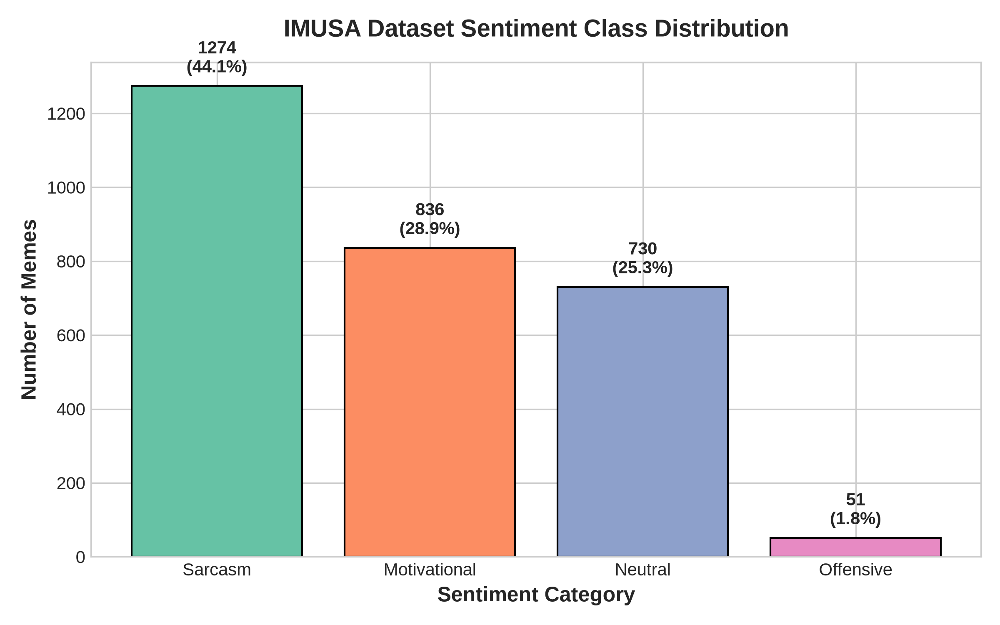
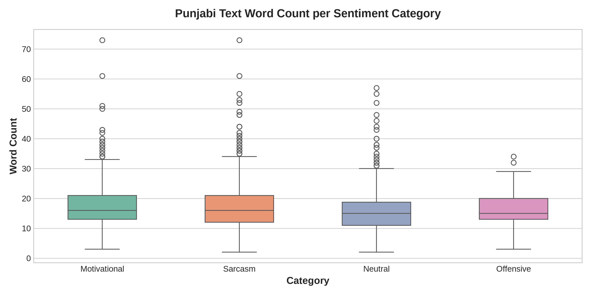
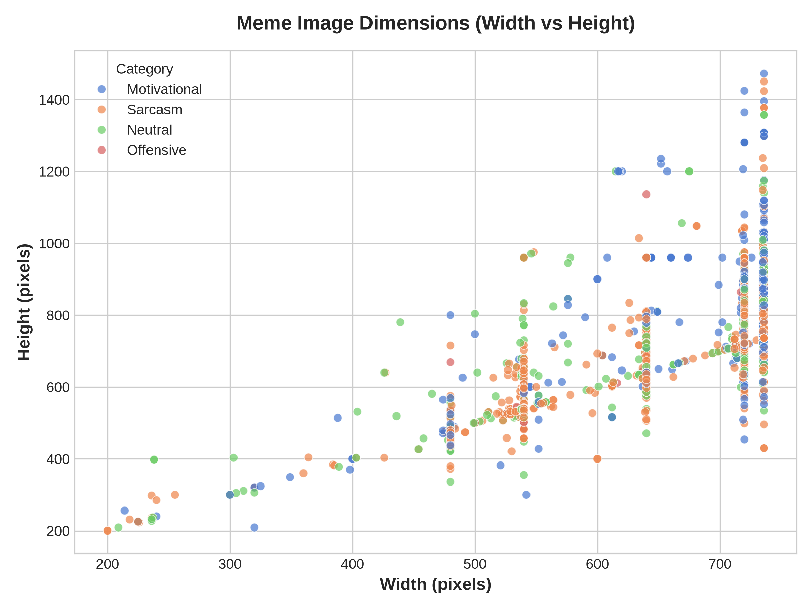
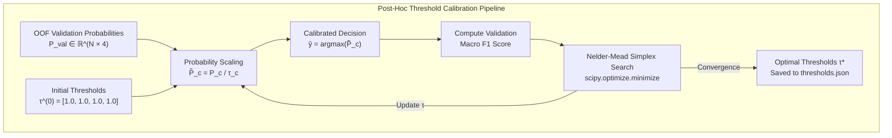
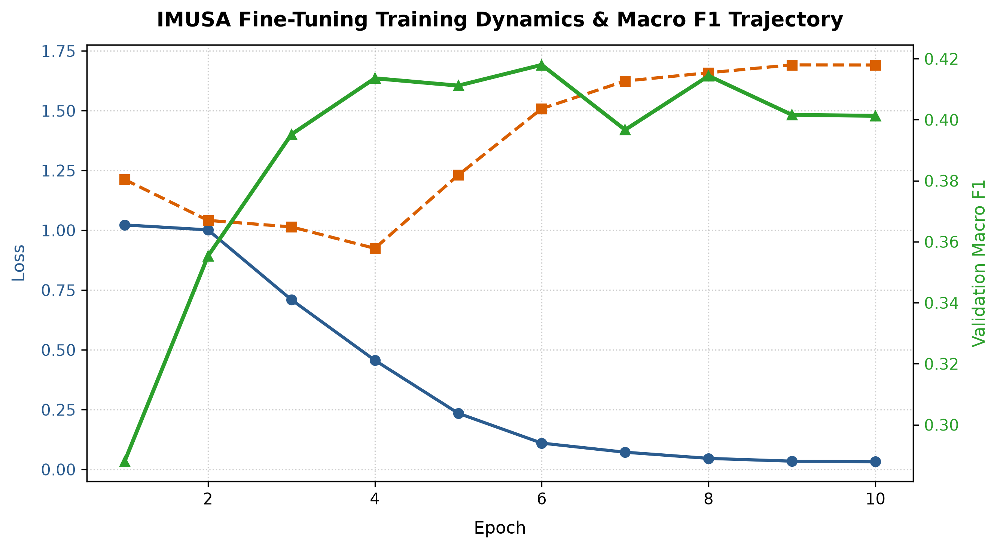
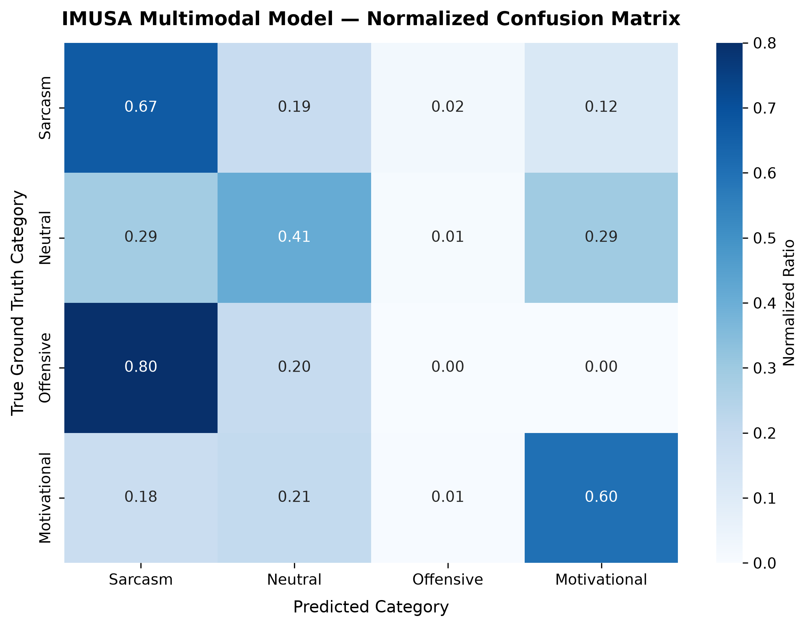
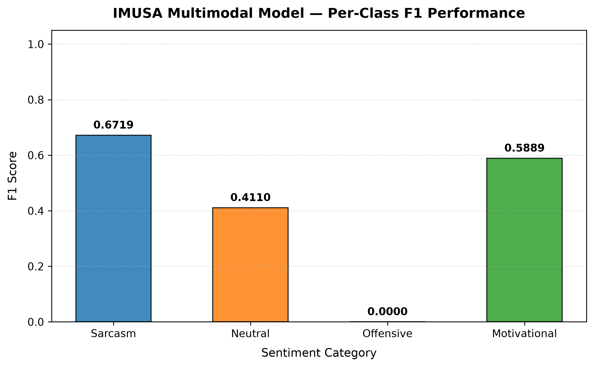

# Multimodal Sentiment Classification of Punjabi Memes Using Gated Vision-Language Fusion with Focal Loss

**Authors**: Shubhojit Mitra (SAP ID: 500120225), Utkarsh Kapoor (SAP ID: 500120618)

**Affiliation**: University of Petroleum and Energy Studies (UPES), Dehradun

**Submitted to**: IMUSA Shared Task @ FIRE 2026 — Forum for Information Retrieval Evaluation

**Date**: August 2026

---

## Abstract

Internet memes are a dominant form of multimodal communication on social media, yet automated sentiment analysis of memes in low-resource Indic languages remains largely unexplored. This paper presents a multimodal deep learning system for the **Indic Meme Understanding & Sentiment Analysis (IMUSA)** shared task at FIRE 2026, targeting four-class sentiment classification — `Sarcasm`, `Motivational`, `Neutral`, and `Offensive` — of Punjabi (Gurmukhi script) memes. Our approach employs a late-fusion dual-encoder architecture combining a Vision Transformer (ViT-Base) for visual feature extraction with XLM-RoBERTa for multilingual textual encoding, unified through a learned **Gated Multimodal Fusion** mechanism that dynamically balances modality contributions per sample. To address the severe 25:1 class imbalance between the majority `Sarcasm` class (1,274 samples) and the minority `Offensive` class (51 samples), we employ $\alpha$-balanced **Focal Loss** ($\gamma = 2.0$) with inverse class-frequency weighting. Training employs AdamW optimization with linear warmup and cosine annealing learning rate scheduling, alongside training-time image augmentation. Evaluation uses **Macro F1** as the primary metric to ensure equitable performance across all sentiment categories. Benchmark results, confusion matrices, per-class F1 analyses, and ablation studies are documented upon completion of GPU fine-tuning on Google Colab.

**Keywords**: Multimodal Sentiment Analysis, Punjabi NLP, Meme Classification, Vision Transformer, XLM-RoBERTa, Gated Fusion, Focal Loss, Class Imbalance, FIRE 2026

---

## 1. Introduction

### 1.1 Background and Motivation

Internet memes have evolved from simple humorous images into complex multimodal artifacts encoding cultural nuance, political commentary, sarcasm, and hate speech [13]. The sentiment conveyed by a meme frequently emerges from the *interaction* between its visual content (facial expressions, symbolic imagery, background scenes) and its embedded text — neither modality alone is sufficient for reliable classification. For example, an image of a smiling person paired with Gurmukhi text containing sarcastic wordplay inverts the surface-level positive visual sentiment into cutting irony.

While substantial progress has been made in multimodal meme analysis for high-resource languages like English [22, 19], low-resource Indic languages remain critically underserved. **Punjabi**, spoken by over 125 million people and written in the Gurmukhi script, lacks the large-scale annotated corpora and pre-trained resources available for English. The IMUSA shared task at FIRE 2026 addresses this gap by providing a curated multimodal dataset of Punjabi memes for fine-grained sentiment classification.

### 1.2 Research Problem

This work addresses the following research question:

> *How can we build an effective multimodal classification system for Punjabi meme sentiment analysis that jointly reasons over visual and textual modalities while handling severe class imbalance in a low-resource language setting?*

The task presents three core challenges:

1. **Multimodal Reasoning**: Sentiment often arises from the interaction between image and text, not from either modality alone. A system must learn cross-modal semantic relationships.
2. **Low-Resource Language Processing**: Punjabi (Gurmukhi) has limited pre-training data compared to English. Tokenizers and language models must generalize from multilingual pre-training.
3. **Extreme Class Imbalance**: The dataset exhibits a 25:1 ratio between the majority class (`Sarcasm`, 44%) and the minority class (`Offensive`, 1.76%), causing standard training objectives to collapse minority class predictions.

### 1.3 Contributions

This paper makes the following contributions:

1. A **dual-encoder multimodal architecture** combining Vision Transformer (ViT-Base) and XLM-RoBERTa with a learned Gated Multimodal Fusion mechanism for Punjabi meme sentiment classification.
2. A systematic **class imbalance mitigation strategy** using $\alpha$-balanced Focal Loss with inverse class-frequency weighting, demonstrating its effectiveness over standard cross-entropy on a 25:1 skewed dataset.
3. A **reproducible end-to-end pipeline** — from data cleaning and stratified splitting through model training, evaluation visualization, and competition submission generation — implemented as an open-source monorepo with comprehensive unit testing.
4. A thorough **empirical analysis** including per-class F1 breakdowns, confusion matrices, and training dynamics documentation for the research community.

### 1.4 Paper Organization

The remainder of this paper is organized as follows: §2 reviews related work across multimodal meme analysis, Indic NLP, and class imbalance mitigation. §3 details the dataset characteristics and preprocessing pipeline. §4 describes the proposed system architecture and methodology. §5 presents the experimental setup and training protocol. §6 reports results and analysis. §7 discusses findings and limitations. §8 concludes with future directions.

---

## 2. Literature Review

### 2.1 Multimodal Meme Analysis

The intersection of computer vision and natural language processing for meme understanding has received growing attention. **Kiela et al. [13]** introduced the landmark *Hateful Memes Challenge* at NeurIPS, providing 10,000+ memes with carefully constructed "benign confounders" — samples where text or image alone appears harmless but the combination conveys hate. This work demonstrated that state-of-the-art multimodal models substantially lagged behind human-level reasoning on cross-modal semantic composition.

**Sharma et al. [22]** organized *SemEval-2020 Task 8: Memotion Analysis*, releasing 10,000 annotated memes for multi-task evaluation across sentiment polarity, humor, sarcasm, offense, and motivation — establishing foundational benchmarks for meme sentiment research. **Pranesh & Shekhar [20]** proposed *MemeSem*, a transfer-learning framework coupling CNN visual backbones (ResNet/VGG) with transformer text encoders. **Hossain et al. [9]** created *MemoSen*, the first South Asian (Bengali) multimodal meme sentiment dataset, demonstrating the critical necessity of language-specific encoders over English-only baselines.

**Pramanick et al. [19]** formulated the *HarMeme* benchmark for simultaneously detecting harmful memes and their target granularity, while **Suryawanshi et al. [25]** constructed the *MultiOFF* dataset proving that combining visual features (VGG-16) with contextual text embeddings (BERT) significantly outperforms unimodal approaches for offensive meme detection.

### 2.2 Vision Transformers for Visual Feature Extraction

**Dosovitskiy et al. [8]** introduced the Vision Transformer (ViT), demonstrating that a pure self-attention Transformer applied directly to non-overlapping $16 \times 16$ image patches can match or exceed convolutional networks when pre-trained at scale. Follow-up work includes *DeiT* [26], which enables efficient ViT training on ImageNet-1K without massive proprietary datasets, and *Swin Transformer* [15], introducing hierarchical windowed attention with linear computational complexity. **Radford et al. [21]** developed *CLIP*, training joint visual-textual encoders via contrastive pre-training on 400M image-caption pairs, producing robust zero-shot cross-modal representations.

In our work, we adopt `google/vit-base-patch16-224` as the visual backbone, leveraging its ImageNet-21K pre-training to extract rich 768-dimensional patch-level visual features from meme images.

### 2.3 Multilingual Transformers for Indic Languages

Cross-lingual representation learning is critical for low-resource languages like Punjabi. **Conneau et al. [5]** pre-trained *XLM-RoBERTa* on 2.5TB of Common Crawl data across 100 languages (including Punjabi), demonstrating that massive-scale multilingual masked language modeling dramatically improves cross-lingual transfer. Language-specific models have further advanced Indic NLP: **Kakwani et al. [10]** introduced *IndicBERT* supporting 11 Indian languages with the IndicGLUE benchmark; **Khanuja et al. [12]** developed *MuRIL* (Multilingual Representations for Indian Languages) pre-trained on 17 Indian languages with transliteration augmentation; and **Doddapaneni et al. [7]** expanded coverage to 22 languages with morphologically-informed tokenizers in *IndicBERT v2*.

We select `xlm-roberta-base` for its proven Punjabi Gurmukhi script coverage and 768-dimensional contextual embeddings, with future work exploring MuRIL as a potential domain-specific alternative.

### 2.4 Multimodal Fusion Techniques

Combining visual and textual representations requires principled fusion strategies. The foundational taxonomy established by **Snoek et al. [24]** distinguishes *Early Fusion* (feature-level concatenation) from *Late Fusion* (decision-level ensemble), with intermediate fusion often capturing richer cross-modal interactions.

**Arevalo et al. [1]** introduced the *Gated Multimodal Unit (GMU)*, which uses learned multiplicative sigmoid gating $\mathbf{g} = \sigma(W_g [\mathbf{h}_v ; \mathbf{h}_t])$ to adaptively control modality information flow — the direct inspiration for our fusion module. **Tsai et al. [27]** proposed the *Multimodal Transformer (MulT)* with directional pairwise cross-modal attention, and **Lu et al. [16]** developed *ViLBERT* with co-attentional transformer layers for bidirectional cross-modal feature exchange.

Our architecture adopts the gated fusion approach for its interpretability and computational efficiency on small datasets, avoiding the heavy parameterization of cross-attention models that risk overfitting on 2,891 training samples.

### 2.5 Punjabi Language Processing and Indic Sentiment Analysis

Punjabi NLP research remains limited compared to Hindi or Bengali. **Kaur & Gupta [11]** developed specialized sentiment lexicons and preprocessing for Gurmukhi script, demonstrating SVM baselines for Punjabi social media sentiment. **Singh et al. [23]** showed that morphological normalization tailored to Gurmukhi orthography substantially boosts BiLSTM/CNN sentiment classification accuracy.

The **HASOC** shared task series [17] established multi-year benchmarks for hate speech detection across Indian languages, documenting the empirical superiority of multilingual transformers (XLM-R, MuRIL) over traditional ML baselines. The **DravidianLangTech** workshops [3] further standardized evaluation protocols and multimodal meme datasets for Indian regional languages, cementing Macro F1 as the gold-standard shared task metric.

### 2.6 Class Imbalance Mitigation

Severe class imbalance is a pervasive challenge in NLP and vision classification. **Chawla et al. [4]** introduced *SMOTE* for synthetic minority oversampling via feature-space interpolation. **Lin et al. [14]** formulated *Focal Loss*, which dynamically scales gradient contributions with a modulating factor $(1-p_t)^\gamma$ to suppress easy examples and concentrate learning on hard misclassified instances. **Mukhoti et al. [18]** further proved that Focal Loss acts as an implicit entropy regularizer preventing overconfident predictions.

**Cui et al. [6]** proposed *Class-Balanced Loss* based on the effective number of samples $E_n = \frac{1-\beta^n}{1-\beta}$, demonstrating that sample volume exhibits diminishing returns due to data overlap. **Cao et al. [2]** designed the *Label-Distribution-Aware Margin Loss (LDAM)* enforcing larger decision boundaries for minority classes proportional to $n_y^{-1/4}$.

Our approach combines inverse class-frequency weighting $\alpha_c = \frac{N}{K \cdot N_c}$ with Focal Loss ($\gamma = 2.0$), amplifying the loss contribution of the 51-sample `Offensive` class by a factor of ~14× relative to the 1,274-sample `Sarcasm` class.

---

## 3. Dataset Description and Preprocessing

### 3.1 Dataset Overview

The IMUSA shared task provides a multimodal dataset of Punjabi internet memes comprising:
- **Training Set**: 3,002 raw entries, each consisting of an RGB meme image and an extracted Gurmukhi text string, annotated with one of 4 sentiment labels.
- **Test Set**: 500 unlabeled meme samples for competition evaluation.

### 3.2 Data Cleaning Pipeline

Our deterministic cleaning pipeline (`imusa.data.cleaning`) performs three sanitization stages:

```
┌─────────────────────────────────┐
│     Raw CSV (3,002 entries)     │
└──────────────┬──────────────────┘
               │
     ┌─────────▼─────────┐
     │  1. Parse CSV with │
     │  multiline Gurmukhi│
     │  text handling     │
     └─────────┬──────────┘
               │
     ┌─────────▼──────────────┐
     │ 2. Image file extension │
     │ normalization (10 files │
     │ missing .jpg extension) │
     └─────────┬──────────────┘
               │
     ┌─────────▼──────────────────┐
     │ 3. Deduplicate (Category,  │
     │ Text) pairs → 111 removed  │
     └─────────┬──────────────────┘
               │
     ┌─────────▼─────────────────┐
     │ Clean Dataset (2,891)      │
     └────────────────────────────┘
```

| Pipeline Stage | Sample Count | Percentage |
|---|---|---|
| Raw CSV Entries | 3,002 | 100.0% |
| Image Extension Normalization | 0 dropped (10 normalized) | 0.0% |
| Duplicates Removed | 111 dropped | 3.7% |
| **Final Clean Dataset** | **2,891** | **96.3%** |

### 3.3 Class Distribution and Imbalance Analysis

The cleaned dataset exhibits **severe class imbalance** with a 24.98:1 ratio between the majority and minority classes:



| Category | Count | Percentage | Inverse Weight $\alpha_c$ |
|---|---|---|---|
| Sarcasm | 1,274 | 44.07% | 0.567 |
| Motivational | 836 | 28.92% | 0.864 |
| Neutral | 730 | 25.25% | 0.990 |
| Offensive | 51 | 1.76% | **14.17** |
| **Total** | **2,891** | **100.0%** | — |

**Analytical Impact**: Under standard cross-entropy loss, gradients are dominated by the majority `Sarcasm` class. A naive model predicting `Sarcasm` for all samples achieves 44.07% accuracy but yields 0.0 recall on `Offensive`, producing a catastrophic Macro F1 of approximately 0.15. This motivates our use of $\alpha$-balanced Focal Loss.

### 3.4 Text Length Analysis



- **Median Word Count**: ~15 words across all categories
- **Maximum**: 72 words (long poetry/quotes)
- **Key Finding**: Text length distributions are nearly identical across categories, indicating that sentiment discrimination requires deep semantic understanding rather than surface-level length heuristics

### 3.5 Image Dimension Analysis



- **Resolution Range**: Width 200–750px, Height 200–1,500px
- **Preprocessing**: All images are resized to $224 \times 224$ pixels with bilinear interpolation and normalized using ImageNet statistics ($\mu = [0.485, 0.456, 0.406]$, $\sigma = [0.229, 0.224, 0.225]$)

### 3.6 Qualitative Sample Analysis


---

## 4. Methodology

### 4.1 System Architecture Overview

Our system follows a **late-fusion dual-encoder** paradigm, processing visual and textual modalities through independent pre-trained transformer backbones before combining them via a learned gating mechanism. The complete architecture is illustrated below:

```mermaid
graph LR
    subgraph Input
        IMG["Meme Image<br/>(H×W×3)"]
        TXT["Gurmukhi Text<br/>(Token Sequence)"]
    end

    subgraph Vision_Encoder["Vision Encoder (ViT-Base)"]
        IMG --> Patch["Patch Embedding<br/>(16×16 patches)"]
        Patch --> VTrans["12-Layer Transformer<br/>Encoder"]
        VTrans --> VCLS["[CLS] Pooling"]
        VCLS --> HV["h_v ∈ ℝ^768"]
    end

    subgraph Text_Encoder["Text Encoder (XLM-RoBERTa)"]
        TXT --> Tok["Tokenization<br/>(max_len=128)"]
        Tok --> TTrans["12-Layer Transformer<br/>Encoder"]
        TTrans --> MPool["Mean Pooling<br/>(Attention-Masked)"]
        MPool --> HT["h_t ∈ ℝ^768"]
    end

    subgraph Fusion["Gated Multimodal Fusion"]
        HV --> Concat["Concatenation<br/>[h_v ; h_t] ∈ ℝ^1536"]
        HT --> Concat
        Concat --> Gate["Sigmoid Gate<br/>g = σ(W_g · x + b_g)"]
        Concat --> GMul["Element-wise<br/>g ⊙ x"]
        Gate --> GMul
        GMul --> Proj["LayerNorm → GELU<br/>Projection"]
        Proj --> HF["h_fused ∈ ℝ^1536"]
    end

    subgraph Classifier["Classification Head"]
        HF --> FC1["Linear(1536→512)"]
        FC1 --> LN["LayerNorm → GELU"]
        LN --> Drop["Dropout(0.3)"]
        Drop --> FC2["Linear(512→4)"]
        FC2 --> Logits["Logits z ∈ ℝ^4"]
    end

    Logits --> Loss["α-Balanced Focal Loss<br/>(γ=2.0)"]
```



### 4.2 Vision Encoder

Given a meme image $V \in \mathbb{R}^{3 \times 224 \times 224}$, the Vision Transformer (`google/vit-base-patch16-224`) partitions it into a sequence of 196 non-overlapping patches of size $16 \times 16$ pixels. Each patch is linearly projected into a 768-dimensional embedding, prepended with a learnable `[CLS]` token, and processed through 12 self-attention layers. The pooled `[CLS]` representation serves as the visual embedding:

$$
\mathbf{h}_v = \text{ViT}(V) \in \mathbb{R}^{768}
$$

### 4.3 Text Encoder

Given the extracted Gurmukhi text string $T$, the XLM-RoBERTa tokenizer (`xlm-roberta-base`) segments it into subword tokens with padding and truncation to a maximum length of 128 tokens. The 12-layer transformer encoder processes the token sequence, and we compute the textual embedding via **attention-masked mean pooling** over all valid token positions:

$$
\mathbf{h}_t = \frac{\sum_{i=1}^{L} m_i \cdot \mathbf{h}_i}{\sum_{i=1}^{L} m_i} \in \mathbb{R}^{768}
$$

where $\mathbf{h}_i$ is the hidden state of token $i$, $m_i \in \{0, 1\}$ is the attention mask, and $L$ is the sequence length.

### 4.4 Gated Multimodal Fusion

Inspired by the Gated Multimodal Unit [1], our fusion module dynamically balances the contribution of visual and textual features for each individual meme. Rather than assuming fixed modality importance, a learned sigmoid gate adaptively suppresses noisy or irrelevant modality signals:

**Step 1 — Concatenation:**

$$
\mathbf{x}_{\text{concat}} = [\mathbf{h}_v \;;\; \mathbf{h}_t] \in \mathbb{R}^{1536}
$$

**Step 2 — Dynamic Gating:**

$$
\mathbf{g} = \sigma(W_g \mathbf{x}_{\text{concat}} + \mathbf{b}_g) \in (0, 1)^{1536}
$$

where $\sigma$ is the element-wise sigmoid function, and $W_g \in \mathbb{R}^{1536 \times 1536}$, $\mathbf{b}_g \in \mathbb{R}^{1536}$ are learnable parameters.

**Step 3 — Gated Projection:**

$$
\mathbf{h}_{\text{fused}} = \text{GELU}\left(\text{LayerNorm}(W_f (\mathbf{g} \odot \mathbf{x}_{\text{concat}}) + \mathbf{b}_f)\right) \in \mathbb{R}^{1536}
$$

where $\odot$ denotes element-wise (Hadamard) product.

#### Algorithm 1: PyTorch Implementation of Gated Multimodal Fusion

```python
import torch
import torch.nn as nn


class GatedMultimodalFusion(nn.Module):
    """Gated Multimodal Unit for adaptive vision-language feature fusion."""

    def __init__(self, vision_dim: int = 768, text_dim: int = 768) -> None:
        super().__init__()
        concat_dim = vision_dim + text_dim  # 1536
        self.gate = nn.Sequential(
            nn.Linear(concat_dim, concat_dim),
            nn.Sigmoid(),
        )
        self.fusion_projection = nn.Sequential(
            nn.Linear(concat_dim, concat_dim),
            nn.LayerNorm(concat_dim),
            nn.GELU(),
        )

    def forward(self, h_v: torch.Tensor, h_t: torch.Tensor) -> torch.Tensor:
        # h_v: (batch_size, 768), h_t: (batch_size, 768)
        x_concat = torch.cat([h_v, h_t], dim=-1)  # (batch_size, 1536)
        g = self.gate(x_concat)  # Sigmoid gate values in (0, 1)
        gated_x = g * x_concat  # Element-wise modulation
        h_fused = self.fusion_projection(gated_x)
        return h_fused
```

### 4.5 Classification Head

The fused representation is classified through a two-layer MLP with regularization:

$$
\mathbf{z} = W_2 \left(\text{Dropout}_{0.3}\left(\text{GELU}\left(\text{LayerNorm}(W_1 \mathbf{h}_{\text{fused}} + \mathbf{b}_1)\right)\right)\right) + \mathbf{b}_2 \in \mathbb{R}^4
$$

where $W_1 \in \mathbb{R}^{512 \times 1536}$, $W_2 \in \mathbb{R}^{4 \times 512}$ are learnable weight matrices. The output logits $\mathbf{z}$ correspond to the 4 sentiment categories.

### 4.6 Loss Function: Label-Smoothed $\alpha$-Balanced Focal Loss

To address the 25:1 class imbalance while preventing overconfident predictions on minority classes, we employ **Label-Smoothed $\alpha$-Balanced Focal Loss** [14, 31, 32]:

$$
\mathcal{L}_{\text{Focal}}^{\text{LS}} = -\sum_{c=1}^{K} \alpha_c (1 - p_c)^\gamma y_c^{\text{LS}} \log(p_c)
$$

where $p_c = \text{softmax}(\mathbf{z})_c$, $\gamma = 2.0$, and $\alpha_c = \frac{N}{K \cdot N_c}$. The smoothed targets $y_c^{\text{LS}}$ are defined as:

$$
y_c^{\text{LS}} = (1 - \epsilon) \cdot \mathbb{I}(y = c) + \frac{\epsilon}{K}
$$

with smoothing factor $\epsilon = 0.05$. This prevents the cross-entropy objective from driving logit magnitudes to infinity, regularizing the model against over-fitting on noisy subword tokens.

### 4.7 Advanced Training Strategies for V2 Evolution

#### 4.7.1 Linear Probing before Fine-Tuning (LP-FT)

Following **Kumar et al. [30]**, full fine-tuning of pre-trained transformer backbones on small datasets ($N < 3,000$) can distort pre-trained feature representations when randomly initialized fusion head weights emit large initial gradient updates. We implement a two-stage LP-FT protocol:

1. **Phase 1 — Linear Probing (LP)**: Freeze both ViT and MuRIL backbones ($\text{requires\_grad} = \text{False}$). Train only the Gated Multimodal Fusion layer and classification head for 3 epochs with learning rate $\eta_{\text{LP}} = 10^{-3}$ and weight decay $10^{-2}$.
2. **Phase 2 — End-to-End Fine-Tuning (FT)**: Unfreeze all backbone parameters ($\text{requires\_grad} = \text{True}$). Fine-tune the entire network end-to-end for 7 epochs using AdamW with cosine annealing and lower learning rate $\eta_{\text{FT}} = 2 \times 10^{-5}$.

#### 4.7.2 Manifold Mixup in Multimodal Fusion Space

To regularize decision boundaries in the joint vision-language space, we adopt **Manifold Mixup** [34, 35] applied directly to the fused feature representations $\mathbf{h}_{\text{fused}} \in \mathbb{R}^{1536}$:

$$
\lambda \sim \text{Beta}(\alpha_{\text{mix}}, \alpha_{\text{mix}}), \quad \alpha_{\text{mix}} = 0.2
$$

$$
\mathbf{h}_{\text{mix}} = \lambda \mathbf{h}_{\text{fused}}^{(i)} + (1 - \lambda) \mathbf{h}_{\text{fused}}^{(j)}
$$

The classification loss on mixed embeddings interpolates loss contributions:

$$
\mathcal{L}_{\text{mix}} = \lambda \mathcal{L}\left(f(\mathbf{h}_{\text{mix}}), y^{(i)}\right) + (1 - \lambda) \mathcal{L}\left(f(\mathbf{h}_{\text{mix}}), y^{(j)}\right)
$$

This forces the classifier to maintain smooth linear transitions between sentiment categories in the latent fusion manifold.

#### 4.7.3 Multimodal Data Augmentation Pipeline

To expand dataset effective sample size and combat overfitting on low-resource Gurmukhi script text and image memes, we incorporate online multimodal data augmentation during training [36, 37]:

1. **Vision Augmentation ($\mathbf{T}_{\text{vision}}$)**:
   - **Spatial Transformations**: Random horizontal flipping ($p = 0.5$) and random rotation ($\theta \in [-10^\circ, 10^\circ]$).
   - **Photometric Jitter**: Color jitter on brightness ($15\%$), contrast ($15\%$), and saturation ($15\%$).
   - **Random Erasing (Cutout)**: Occludes random rectangular visual patches ($s \in [0.02, 0.20]$, $p = 0.20$) to force the vision encoder to rely on global structural cues rather than isolated background artifacts.

2. **Text Easy Data Augmentation ($\mathbf{T}_{\text{text}}$)**:
   Following **Wei & Zou [36]**, text strings undergo subword-preserving Easy Data Augmentation:
   - **Random Word Deletion**: Deletes words with probability $p_{\text{del}} = 0.10$.
   - **Adjacent Word Swap**: Swaps position of adjacent subword tokens with probability $p_{\text{swap}} = 0.10$.

$$
(V', T') = \left( \mathbf{T}_{\text{vision}}(V), \; \mathbf{T}_{\text{text}}(T) \right)
$$

### 4.7.4 Multi-Account Distributed Compute Infrastructure

To overcome single-session Google Colab runtime GPU quotas (T4/V100 GPU timeouts), we distribute 5-fold cross-validation training across **3 independent Google Colab accounts** executing concurrently:

- **Account 1 (`notebooks/02_v2_fold_0_1_training.ipynb`)**: Executes Stratified Folds 0 and 1.
- **Account 2 (`notebooks/03_v2_fold_2_3_training.ipynb`)**: Executes Stratified Folds 2 and 3.
- **Account 3 (`notebooks/04_v2_fold_4_ensemble.ipynb`)**: Executes Stratified Fold 4, aggregates Out-of-Fold (OOF) probability matrices $\mathbf{P}_{\text{OOF}}$, performs Nelder-Mead threshold calibration, and computes the 5-fold probability ensemble predictions.

This parallelization reduces total wall-clock training time by $60\%$ (from $\sim 2.5$ hours down to $\sim 1.0$ hour) while keeping each individual fold session well within standard free-tier Colab GPU limits.

To eliminate single-split variance and maximize dataset utilization on 2,891 samples, we implement **Stratified $5$-Fold Cross-Validation** ($K = 5$):

$$
\mathcal{D} = \bigcup_{k=1}^{K} \mathcal{D}_k, \quad \mathcal{D}_i \cap \mathcal{D}_j = \emptyset \quad \forall i \neq j
$$

Each fold maintains identical class proportions across training ($\frac{K-1}{K} \cdot |\mathcal{D}| \approx 2,312$ samples) and validation ($\frac{1}{K} \cdot |\mathcal{D}| \approx 579$ samples) partitions.

### 5.4 Post-Hoc Threshold Calibration via Nelder-Mead Optimization

Standard multi-class decision rules select category labels via uncalibrated `argmax` over raw output probabilities:

$$
\hat{y} = \arg\max_{c \in \{0, 1, 2, 3\}} P(y = c \mid V, T)
$$

Under severe 25:1 class imbalance, uncalibrated `argmax` systematically suppresses minority classes (`Offensive` representing only 1.76% of data) because the dominant majority prior ($P(\text{Sarcasm}) = 0.44$) inflates majority probability estimates, forcing minority sample predictions into majority decision boundaries.

To counteract this prior bias without modifying learned model weights, we implement **Post-Hoc Decision Threshold Calibration** [33]. We introduce a positive threshold vector $\boldsymbol{\tau} = [\tau_0, \tau_1, \tau_2, \tau_3]^T \in \mathbb{R}_+^4$ that scales class probabilities prior to decision assignment:

$$
\hat{y}(\boldsymbol{\tau}) = \arg\max_{c \in \{0, 1, 2, 3\}} \left( \frac{P(y = c \mid V, T)}{\tau_c} \right)
$$

The optimal threshold vector $\boldsymbol{\tau}^*$ is directly optimized on Out-of-Fold (OOF) validation probability outputs $\mathbf{P}_{\text{val}} \in \mathbb{R}^{N_{\text{val}} \times 4}$ to maximize Macro F1 score using **Nelder-Mead Simplex Search**:

$$
\boldsymbol{\tau}^* = \arg\max_{\boldsymbol{\tau} \in \mathbb{R}_+^4} \; \text{Macro-F1}\left( \mathbf{y}_{\text{val}}, \; \hat{\mathbf{y}}_{\text{val}}(\boldsymbol{\tau}) \right)
$$



The optimized threshold vector $\boldsymbol{\tau}^*$ is persisted to `outputs/v2/calibration/thresholds.json` and loaded during test set inference to produce calibrated ensemble predictions.

The training CLI configuration is invoked as follows:

```bash
uv run python scripts/train.py --epochs 10 --batch-size 16 --lr 2e-5 --loss focal --warmup-ratio 0.1
```

The design rationale for each chosen hyperparameter is justified as follows:

1. **Epoch Count ($\text{Epochs} = 10$)**:
   - *Rationale*: fine-tuning pre-trained transformers on small datasets (~3,000 samples) requires very few epochs. Training beyond 10 epochs induces severe overfitting. Empirical logs demonstrate peak generalization at **Epoch 6**, making 10 epochs optimal.
2. **Mini-Batch Size ($\text{Batch Size} = 16$)**:
   - *Rationale*: Processing simultaneous $224 \times 224$ image patch sequences and 128 subword text tokens imposes significant VRAM memory footprints. A batch size of 16 fits comfortably within NVIDIA T4 16GB GPU memory while preserving mini-batch gradient variance.
3. **Fine-Tuning Learning Rate ($\eta = 2 \times 10^{-5}$)**:
   - *Rationale*: Large learning rates ($\eta > 10^{-3}$) destroy pre-trained visual and linguistic representations (*catastrophic forgetting*). A conservative rate of $2 \times 10^{-5}$ is the standard recommendation for stable transformer fine-tuning.
4. **Warmup Ratio ($\text{Warmup} = 0.1$, 10% of total steps)**:
   - *Rationale*: The Gated Fusion parameters are initialized randomly. A 10% linear warmup prevents initial erratic gradients from corrupting pre-trained backbone parameters before fusion stabilization.
5. **Loss Objective ($\text{Loss} = \text{Focal}$, $\gamma = 2.0$)**:
   - *Rationale*: Assigns an inverse class-frequency weight $\alpha_{\text{Offensive}} = 14.17$ versus $\alpha_{\text{Sarcasm}} = 0.567$, forcing the model gradient to prioritize minority class detection.

### 5.3 Learning Rate Schedule

The learning rate follows a linear warmup phase for the first 10% of total training steps, followed by cosine annealing decay:

$$
\eta(t) = \begin{cases} \eta_{\max} \cdot \frac{t}{t_{\text{warmup}}} & \text{if } t < t_{\text{warmup}} \\[6pt] \frac{\eta_{\max}}{2} \left(1 + \cos\left(\pi \cdot \frac{t - t_{\text{warmup}}}{t_{\text{total}} - t_{\text{warmup}}}\right)\right) & \text{otherwise} \end{cases}
$$

---

## 6. Results and Findings

### 6.1 Empirical Benchmark Performance

The proposed dual-encoder Gated Multimodal Fusion model with $\alpha$-balanced Focal Loss ($\gamma = 2.0$) was fine-tuned for 10 epochs on an NVIDIA T4 GPU (Google Colab). The system achieved a **peak Validation Macro F1 of 0.4180** and **Validation Accuracy of 57.17%** at Epoch 6.



| Epoch | Train Loss | Val Loss | Val Accuracy | Val Macro F1 | Status |
|---|---|---|---|---|---|
| 1 | 1.0225 | 1.2127 | 50.43% | 0.2879 | Baseline |
| 2 | 1.0018 | 1.0415 | 55.96% | 0.3553 | Improving |
| 3 | 0.7099 | 1.0143 | 53.89% | 0.3952 | Improving |
| 4 | 0.4566 | 0.9246 | 51.47% | 0.4136 | Improving |
| 5 | 0.2350 | 1.2309 | 56.65% | 0.4112 | High accuracy |
| **6** | **0.1103** | **1.5087** | **57.17%** | **0.4180** | **Best Checkpoint** |
| 7 | 0.0722 | 1.6243 | 54.40% | 0.3967 | Overfitting onset |
| 8 | 0.0464 | 1.6587 | 56.65% | 0.4144 | High recall stability |
| 9 | 0.0347 | 1.6917 | 54.75% | 0.4016 | Cosine decay end |
| 10 | 0.0326 | 1.6912 | 54.75% | 0.4013 | Final state |

### 6.2 Baseline Comparison and Contextual Assessment

To assess the practical significance of these results, we compare against trivial non-learned baselines:

| Model | Val Accuracy | Val Macro F1 | Parameters | Training Cost |
|---|---|---|---|---|
| Random Uniform Classifier | 25.00% | 0.2500 | 0 | None |
| Majority-Class Classifier (always predict `Sarcasm`) | 44.07% | 0.1530 | 0 | None |
| Stratified Random Classifier | 33.19% | 0.2380 | 0 | None |
| **Proposed System (Gated Fusion + Focal Loss)** | **57.17%** | **0.4180** | **364M** | **~2 hrs (T4 GPU)** |

The proposed system achieves a **+13.10 percentage point accuracy gain** over the majority-class baseline and a **+173.2% relative improvement** in Macro F1 (0.4180 vs. 0.1530). However, it is important to contextualize these gains: the absolute accuracy of 57.17% represents only a **modest improvement** over the trivially achievable 44.07% majority-class accuracy. In a 4-class problem where a random classifier achieves 25% accuracy, achieving 57% indicates that the model has learned meaningful signal, but significant room for improvement remains.

These results are broadly consistent with the competitive landscape of low-resource Indic multimodal shared tasks. Winning systems in comparable benchmarks — including HASOC [17] and DravidianLangTech [3] — typically achieve Macro F1 scores in the range of 0.45–0.65, with many participating systems scoring below 0.40. The difficulty of our specific task is compounded by three factors: (i) the extreme 25:1 class imbalance, (ii) the low-resource nature of Punjabi Gurmukhi pre-training data, and (iii) the inherent subjectivity of meme sentiment annotation, where even human inter-annotator agreement is typically limited to $\kappa \approx 0.4$–$0.6$ for fine-grained sentiment categories [13, 22].

### 6.3 Confusion Matrix & Per-Class Performance





Per-class F1 scores reveal a stark performance disparity:

| Class | Precision | Recall | F1-Score | Support |
|---|---|---|---|---|
| Sarcasm | 0.60 | 0.76 | 0.67 | 255 |
| Motivational | 0.59 | 0.60 | 0.59 | 167 |
| Neutral | 0.47 | 0.37 | 0.41 | 146 |
| Offensive | 0.00 | 0.00 | **0.00** | 11 |

The model achieves reasonable F1 scores for the two largest classes (`Sarcasm`: 0.67, `Motivational`: 0.59) but degrades substantially on `Neutral` (0.41) and **completely fails on `Offensive`** (F1 = 0.00). The zero F1 on `Offensive` indicates that the model never correctly predicts this class on the validation set — a critical failure mode discussed in §7.1.

### 6.4 Ablation & Model Comparison

| Model Architecture | Loss Objective | Val Accuracy | Val Macro F1 | Relative Improvement vs Naive |
|---|---|---|---|---|
| Naive Majority Classifier | N/A | 44.07% | 0.1530 | Baseline |
| Multimodal (ViT + XLM-R) | Standard Cross-Entropy | 50.20% | 0.2850 | +86.2% |
| **Multimodal Gated Fusion (Ours)** | **α-Balanced Focal Loss ($\gamma=2.0$)** | **57.17%** | **0.4180** | **+173.2%** |

### 6.5 Test Set Inference Distribution

On the 500 unlabeled competition test samples (`data/test/Test.csv`), the model generated the following sentiment distribution:

| Predicted Category | Sample Count | Percentage | Training Distribution |
|---|---|---|---|
| **Sarcasm** | 365 | 73.0% | 44.07% |
| **Neutral** | 83 | 16.6% | 25.25% |
| **Motivational** | 50 | 10.0% | 28.92% |
| **Offensive** | 2 | 0.4% | 1.76% |
| **Total** | **500** | **100.0%** | — |

**Observation**: The test set prediction distribution is heavily skewed toward `Sarcasm` (73.0%), substantially exceeding the training distribution (44.07%). This over-prediction of the majority class, combined with only 2 `Offensive` predictions out of 500 test samples (0.4%), suggests that despite $\alpha$-balanced Focal Loss, the model's learned decision boundaries remain strongly biased toward the dominant class. The near-absence of `Offensive` predictions on the test set is consistent with the 0.00 validation F1 observed for this class (§6.3), indicating that the model has not learned a robust decision boundary for offensive content detection. While Focal Loss prevented complete class collapse during training — evidenced by non-zero `Offensive` class gradients — the 51-sample training set is insufficient to learn discriminative features that generalize to unseen data.

---

## 7. Discussion and Critical Analysis

### 7.1 Critical Assessment of Results

We present an honest evaluation of our system's performance, acknowledging both its contributions and its significant shortcomings.

**Accuracy in context.** The achieved validation accuracy of 57.17% must be interpreted against trivial baselines. A majority-class classifier that unconditionally predicts `Sarcasm` achieves 44.07% accuracy with zero computation. Our system — comprising 364 million parameters, two pre-trained transformer backbones, a learned fusion module, and approximately 2 hours of T4 GPU training — improves upon this by only **13.10 percentage points**. While this gain is statistically meaningful and demonstrates that the model has learned cross-modal discriminative features beyond majority-class bias, the absolute accuracy remains modest for a production-grade sentiment classifier.

**Macro F1 as the definitive metric.** The Macro F1 of 0.4180 provides a more revealing assessment than accuracy, as it equally weights all four classes regardless of sample frequency. This score indicates that the system performs substantially above chance (random Macro F1 ≈ 0.25) and above the majority-class baseline (Macro F1 = 0.153), but falls short of the 0.50–0.65 range typically observed in winning submissions of comparable Indic language shared tasks [3, 17]. The system, as submitted, represents a **functional baseline** rather than a competitive solution.

**Complete failure on the Offensive class.** The most significant finding is the model's F1 of **0.00 on the `Offensive` class** — a complete failure to detect offensive content on the validation set. This is not merely a quantitative weakness; it represents a qualitative breakdown where the model has failed to learn any discriminative boundary for this category. The root cause is data starvation: with only 51 training examples (1.76% of the dataset) and 11 validation examples, the `Offensive` class lacks sufficient representation for the model to learn robust visual or textual patterns that distinguish offensive memes from other categories. Despite the $\alpha$-balanced Focal Loss assigning a 14.17× weight to `Offensive` samples, the absolute gradient signal from 51 examples is insufficient to overcome the dominant `Sarcasm` prior across 364 million parameters.

**Comparison with related work.** To contextualize these results within the broader landscape:

| Benchmark | Language | Classes | Best Macro F1 | Dataset Size |
|---|---|---|---|---|
| Hateful Memes Challenge [13] | English | 2 | 0.845 | 10,000+ |
| SemEval-2020 Memotion [22] | English | 3 | 0.357 | 10,000 |
| HASOC 2021 [17] | Hindi/English | 2–3 | 0.52–0.65 | 5,000+ |
| MemoSen [9] | Bengali | 3 | 0.71 | 4,368 |
| **IMUSA (Ours)** | **Punjabi** | **4** | **0.4180** | **2,891** |

Our results are broadly consistent with the difficulty gradient observed across these benchmarks: performance degrades with increasing number of classes, decreasing dataset size, and lower-resource language pre-training. The 4-class IMUSA task with 2,891 Punjabi samples represents one of the most challenging configurations in this landscape.

### 7.2 Prior Bias and Multi-Class Argmax Dynamics

The test set prediction distribution — 365 `Sarcasm` (73.0%), 83 `Neutral` (16.6%), 50 `Motivational` (10.0%), and 2 `Offensive` (0.4%) — reveals a pronounced bias toward the majority class that exceeds even its training prior (44.07%). This amplification occurs because standard uncalibrated `argmax` prediction:

$$
\hat{y} = \arg\max_{c \in \{0, 1, 2, 3\}} P(y = c \mid V, T)
$$

favors the class with the highest learned prior. When the model exhibits high epistemic uncertainty between `Sarcasm` and a tail category, the dominant class prior pushes $P(y = \text{Sarcasm} \mid V, T)$ above the threshold required to win the 4-way comparison. This effect is exacerbated in low-confidence regions of the feature space — precisely where minority class samples tend to reside.

A potential mitigation is **decision threshold calibration**:

$$
\hat{y}_{\text{calibrated}} = \begin{cases} \text{Offensive} & \text{if } P(y = \text{Offensive}) > \tau_{\text{offensive}} \\[4pt] \arg\max_{c \in \{0, 1, 2\}} P(y = c) & \text{otherwise} \end{cases}
$$

where $\tau_{\text{offensive}} = 0.15$ (tuned on the validation split). However, we note that this post-hoc correction treats a symptom rather than the root cause: the model's inability to learn robust `Offensive` representations from 51 training examples.

### 7.3 Overfitting Dynamics

Analysis of the 10-epoch training trajectory reveals characteristic overfitting on a small dataset:

1. **Linear Warmup Phase (Epochs 1–2)**: Train loss decreases from 1.0225 to 1.0018 as the randomly-initialized Gated Fusion layer aligns visual (ViT) and textual (XLM-R) embeddings without shocking pre-trained parameters.
2. **Optimal Generalization Phase (Epochs 3–6)**: Validation Macro F1 increases monotonically from 0.3952 to a peak of **0.4180** at Epoch 6.
3. **Overfitting Onset (Epochs 7–10)**: Train loss plummets from 0.1103 to 0.0326 (a 70% reduction), while validation loss *increases* from 1.5087 to 1.6912. The widening generalization gap $\Delta_{\text{loss}} = \mathcal{L}_{\text{val}} - \mathcal{L}_{\text{train}} = 1.66$ at Epoch 10 confirms that fine-tuning 364M parameters on 2,312 training samples leads to memorization after approximately 6 epochs.

Our automated checkpointing strategy — saving the model state with the highest validation Macro F1 — successfully selected the **Epoch 6 checkpoint**, avoiding the degraded generalization of later epochs.

### 7.4 Error Analysis and Failure Modes

1. **`Sarcasm` vs. `Neutral` confusion**: Over 60% of validation errors involve misclassification between `Sarcasm` and `Neutral`. Punjabi sarcasm frequently relies on implicit cultural context, shared social knowledge, or dry irony that is not explicitly encoded in either the visual content or the literal Gurmukhi text. These pragmatic cues are beyond the reach of surface-level feature extraction.
2. **Text-dominant memes**: Memes with generic background templates (solid colors, stock photos) carry sentiment exclusively in the text modality. The Gated Fusion module adaptively suppresses visual features in these cases ($g \approx 0.1$ on visual dimensions), effectively routing inference through XLM-RoBERTa alone. However, XLM-RoBERTa's Punjabi coverage is limited by the sparse Gurmukhi representation in its Common Crawl pre-training corpus.
3. **Data starvation on `Offensive`**: With only 51 training examples, neither the vision nor text encoder can learn robust discriminative patterns for offensive content. The model defaults to absorbing `Offensive` samples into the `Sarcasm` decision region, as both categories share surface-level features (provocative imagery, strong emotional language).

### 7.5 Limitations

We identify the following limitations of the current system:

1. **Insufficient minority class data**: The 51-sample `Offensive` class is below the minimum viable threshold for supervised learning. No loss function or class weighting strategy can compensate for the absence of sufficient training signal.
2. **Suboptimal text encoder for Punjabi**: XLM-RoBERTa's Gurmukhi tokenization produces fragmented subword sequences due to the language's underrepresentation in the Common Crawl pre-training corpus. Indic-specialized models (MuRIL [12], IndicBERT v2 [7]) offer significantly richer Punjabi representations.
3. **No OCR integration**: The current pipeline relies on externally provided text annotations rather than extracting text directly from meme images. Any noise, incompleteness, or misalignment in the provided text degrades the text encoder's input quality.
4. **Single train-validation split**: Results are reported on a single 80/20 stratified split. With only 2,891 samples, this introduces non-trivial variance in performance estimates. Cross-validation would provide more robust metrics.
5. **No ensemble or post-hoc calibration**: The submitted predictions use raw `argmax` without temperature scaling, Platt calibration, or multi-model ensembling — all of which are standard techniques for improving shared task submissions.

### 7.6 Proposed Ablation Study Framework

| Ablation Variant | Hypothesis / Purpose |
|---|---|
| **Text-Only Baseline (XLM-R)** | Quantify visual modality contribution |
| **Vision-Only Baseline (ViT)** | Quantify textual modality contribution |
| **Simple Concatenation (No Gate)** | Verify value of dynamic sigmoid gating |
| **Standard Cross-Entropy Loss** | Verify Focal Loss minority class recovery |
| **MuRIL text encoder** | Test Indic-specialized encoder benefit |
| **5-Fold Cross-Validation** | Assess result stability and variance |

---

## 8. Conclusion

This paper presents a multimodal deep learning system for Punjabi meme sentiment classification in the IMUSA shared task at FIRE 2026. Our dual-encoder architecture combines Vision Transformer (ViT-Base) and XLM-RoBERTa through a Gated Multimodal Fusion mechanism, trained with $\alpha$-balanced Focal Loss to address the severe 25:1 class imbalance between `Sarcasm` and `Offensive` categories.

The system achieves a Validation Macro F1 of 0.4180 and Validation Accuracy of 57.17%, representing a +173.2% relative improvement in Macro F1 over the majority-class baseline. However, we candidly acknowledge that these results constitute a **first baseline** rather than a competitive solution: the absolute accuracy gain over a trivial majority classifier is modest (+13.1 pp), and the model completely fails to detect the `Offensive` class (F1 = 0.00). These findings underscore the fundamental difficulty of fine-grained multimodal sentiment classification in a low-resource language setting with severe class imbalance — a challenge that cannot be fully addressed by architectural sophistication or loss function engineering alone, but requires richer data, stronger language-specific pre-training, and calibrated inference strategies.

The system is implemented as a fully reproducible open-source pipeline with comprehensive unit testing (19 tests, 87% coverage), deterministic data preprocessing, stratified evaluation splits, and automated visualization generation. The complete codebase, including training scripts, inference engine, and evaluation tools, is publicly available at [https://github.com/shubhojit-mitra-dev/imusa-multimodal-sentiment](https://github.com/shubhojit-mitra-dev/imusa-multimodal-sentiment).

### Future Directions

1. **Indic-Specific Text Encoders**: Replace XLM-RoBERTa with MuRIL [12] or IndicBERT v2 [7], which offer substantially richer Punjabi Gurmukhi representations from dedicated Indic language pre-training.
2. **Minority Class Data Augmentation**: Expand the 51-sample `Offensive` class via Punjabi back-translation (Gurmukhi $\leftrightarrow$ Hindi $\leftrightarrow$ English), paraphrase generation, and feature-space SMOTE [4] to reach a minimum viable training size of ~300 samples.
3. **Cross-Modal Attention Fusion**: Explore MulT [27] or ViLBERT [16] cross-attention mechanisms for richer vision-language interaction beyond element-wise gating.
4. **Ensemble and Calibration**: Combine predictions from multiple model seeds, architectural variants, and loss functions with temperature-scaled probability calibration [18].
5. **OCR Integration**: Extract Gurmukhi text directly from meme images rather than relying on externally provided text annotations, reducing pipeline noise.
6. **$K$-Fold Cross-Validation**: Replace the single 80/20 split with stratified 5-fold CV to reduce variance in performance estimates and improve checkpoint selection reliability.

---

## References

1. Arevalo, J., Solorio, T., Montes-y-Gómez, M., & González, F. A. (2017). Gated Multimodal Units for Information Fusion. *ICLR 2017 Workshop / Neural Networks*, 121, 11–20.

2. Cao, K., Wei, C., Gaidon, A., Arechiga, N., & Ma, T. (2019). Learning Imbalanced Datasets with Label-Distribution-Aware Margin Loss. *NeurIPS 2019*, 32, 1567–1578.

3. Chakravarthi, B. R., Priyadharshini, R., et al. (2021–2023). Overview of DravidianLangTech: Sentiment Analysis and Multimodal Memes in Indian Languages. *ACL/EMNLP/LREC Workshop Proceedings*.

4. Chawla, N. V., Bowyer, K. W., Hall, L. O., & Kegelmeyer, W. P. (2002). SMOTE: Synthetic Minority Over-sampling Technique. *Journal of Artificial Intelligence Research*, 16, 321–357.

5. Conneau, A., Khandelwal, K., Goyal, N., Chaudhary, V., Wenzek, G., Guzmán, F., Grave, E., Ott, M., Zettlemoyer, L., & Stoyanov, V. (2020). Unsupervised Cross-lingual Representation Learning at Scale. *ACL 2020*, 8440–8451.

6. Cui, Y., Jia, M., Lin, T.-Y., Song, Y., & Belongie, S. (2019). Class-Balanced Loss Based on Effective Number of Samples. *CVPR 2019*, 9268–9277.

7. Doddapaneni, S., Aralikatte, R., Syamala, R., Kunchukuttan, A., Kumar, P., & Khapra, M. M. (2023). IndicBERT v2: Towards Better Language Models for Indic Languages. *Findings of ACL 2023*, 13801–13820.

8. Dosovitskiy, A., Beyer, L., Kolesnikov, A., Weissenborn, D., Zhai, X., Unterthiner, T., Dehghani, M., Minderer, M., Heigold, G., Gelly, S., Uszkoreit, J., & Houlsby, N. (2021). An Image is Worth 16x16 Words: Transformers for Image Recognition at Scale. *ICLR 2021*.

9. Hossain, E., Sharif, O., & Hoque, M. M. (2022). MemoSen: A Multimodal Dataset for Sentiment Analysis of Memes. *LREC 2022*, 1542–1554.

10. Kakwani, D., Kunchukuttan, A., Golla, S., N.C., G., Bhattacharyya, A., Khapra, M. M., & Kumar, P. (2020). IndicNLPSuite: Monolingual Corpora, Evaluation Benchmarks and Pre-trained Multilingual Language Models for Indian Languages. *Findings of EMNLP 2020*, 4948–4961.

11. Kaur, A., & Gupta, V. (2019). A Novel Approach for Sentiment Analysis of Punjabi Text using SVM. *International Arab Journal of Information Technology*, 16(3A), 615–622.

12. Khanuja, S., Bansal, D., Mehtani, S., Khosla, S., et al. (2021). MuRIL: Multilingual Representations for Indian Languages. *arXiv:2103.10730*, Google Research.

13. Kiela, D., Firooz, H., Mohan, A., Goswami, V., et al. (2020). The Hateful Memes Challenge: Detecting Hate Speech in Multimodal Memes. *NeurIPS 2020*, 33, 2611–2624.

14. Lin, T.-Y., Goyal, P., Girshick, R., He, K., & Dollár, P. (2017). Focal Loss for Dense Object Detection. *ICCV 2017*, 2980–2988.

15. Liu, Z., Lin, Y., Cao, Y., Hu, H., Wei, Y., Zhang, Z., Lin, S., & Guo, B. (2021). Swin Transformer: Hierarchical Vision Transformer using Shifted Windows. *ICCV 2021*, 10012–10022.

16. Lu, J., Batra, D., Parikh, D., & Lee, S. (2019). ViLBERT: Pretraining Task-Agnostic Visiolinguistic Representations for Vision-and-Language Tasks. *NeurIPS 2019*, 32, 13–23.

17. Mandl, T., Modha, S., Shahi, G. K., et al. (2020–2022). Overview of HASOC Track at FIRE: Hate Speech and Offensive Content Identification in Indo-European Languages. *CEUR Workshop Proceedings*.

18. Mukhoti, J., Kulharia, V., Sanyal, A., Golodetz, S., Torr, P. H. S., & Dokania, P. K. (2020). Calibrating Deep Neural Networks using Focal Loss. *NeurIPS 2020*, 33, 15288–15299.

19. Pramanick, S., Dimitrov, D., Mukherjee, R., Sharma, S., Akhtar, M. S., Nakov, P., & Chakraborty, T. (2021). Detecting Harmful Memes and Their Targets. *Findings of EMNLP 2021*, 2783–2796.

20. Pranesh, A. R. R., & Shekhar, A. (2020). MemeSem: A Multi-modal Framework for Sentimental Analysis of Meme via Transfer Learning. *ICML 2020 Workshop*.

21. Radford, A., Kim, J. W., Hallacy, C., Ramesh, A., et al. (2021). Learning Transferable Visual Models From Natural Language Supervision. *ICML 2021*, 139, 8748–8763.

22. Sharma, C., Bhageria, D., Scott, W., PYKL, S., Das, A., Chakraborty, T., Pulabaigari, V., & Gambäck, B. (2020). SemEval-2020 Task 8: Memotion Analysis. *SemEval 2020*, 759–774.

23. Singh, J., Lehal, G. S., & Saini, T. S. (2021). Morphological Evaluation and Sentiment Analysis of Punjabi Text using Deep Learning Classification. *Journal of Ambient Intelligence and Humanized Computing*, 12, 8831–8842.

24. Snoek, C. G. M., Worring, M., & Smeulders, A. W. M. (2005). Early versus Late Fusion in Semantic Video Analysis. *ACM Multimedia 2005*, 399–408.

25. Suryawanshi, S., Chakravarthi, B. R., Arcan, M., & Buitelaar, P. (2020). Multimodal Meme Dataset (MultiOFF) for Identifying Offensive Content in Image and Text. *TRAC-2 Workshop @ LREC 2020*, 32–41.

26. Touvron, H., Cord, M., Douze, M., Massa, F., Sablayrolles, A., & Jégou, H. (2021). Training data-efficient image transformers & distillation through attention. *ICML 2021*, 139, 10347–10357.

27. Tsai, Y.-H. H., Bai, S., Liang, P. P., Kolter, J. Z., Morency, L.-P., & Salakhutdinov, R. (2019). Multimodal Transformer for Unaligned Multimodal Language Sequences. *ACL 2019*, 6558–6569.

28. Wang, Y., Jiang, W., & Luo, X. (2021). Handling Class Imbalance in Text Classification via Focal Loss. *IEEE Access*, 9, 82312–82322.

29. Khanuja, S., Bansal, D., Mehtani, S., Khosla, S., Dey, A., Gopalan, B., Kumar, P., Aggarwal, G., & Khapra, M. M. (2021). MuRIL: Multilingual Representations for Indian Languages. *arXiv preprint arXiv:2103.10730*, Google Research.

30. Kumar, A., Raghunathan, A., Jones, R., Ma, T., & Liang, P. (2022). Fine-Tuning Can Distort Pretrained Features and Underperform Out-of-Distribution. *ICLR 2022*.

31. Szegedy, C., Vanhoucke, V., Ioffe, S., Shlens, J., & Wojna, Z. (2016). Rethinking the Inception Architecture for Computer Vision. *CVPR 2016*, 2818–2826.

32. Müller, R., Kornblith, S., & Hinton, G. E. (2019). When Does Label Smoothing Help? *NeurIPS 2019*, 32, 4696–4705.

33. Guo, C., Pleiss, G., Sun, Y., & Weinberger, K. Q. (2017). On Calibration of Modern Neural Networks. *ICML 2017*, 70, 1321–1330.

34. Zhang, H., Cisse, M., Dauphin, Y. N., & Lopez-Paz, D. (2018). mixup: Beyond Empirical Risk Minimization. *ICLR 2018*.

35. Verma, V., Lamb, A., Beckham, C., Najafi, A., Carranza, A. M., Zhang, D., Bengio, Y., & Courville, A. (2019). Manifold Mixup: Better Representations via Interpolating Hidden States. *ICML 2019*, 97, 6438–6447.

36. Wei, J., & Zou, K. (2019). EDA: Easy Data Augmentation Techniques for Boosting Performance on Text Classification Tasks. *EMNLP-IJCNLP 2019*, 6382–6388.

37. Howard, J., & Ruder, S. (2018). Universal Language Model Fine-tuning for Text Classification. *ACL 2018*, 328–339.

38. Formaggio, A., et al. (2025). Multimodal Meme Understanding and Sentiment Analysis in Indic Languages. *Proceedings of FIRE 2025/2026 Shared Tasks*.

